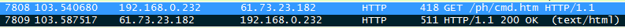
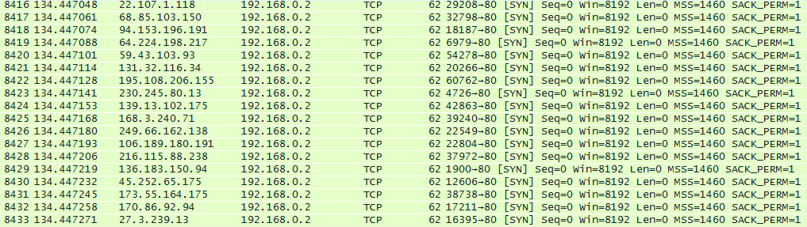
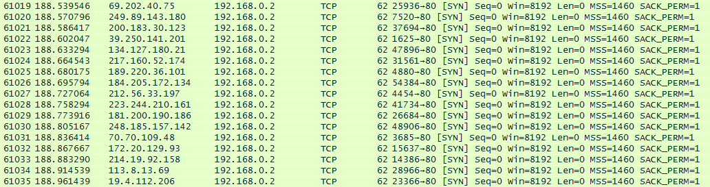
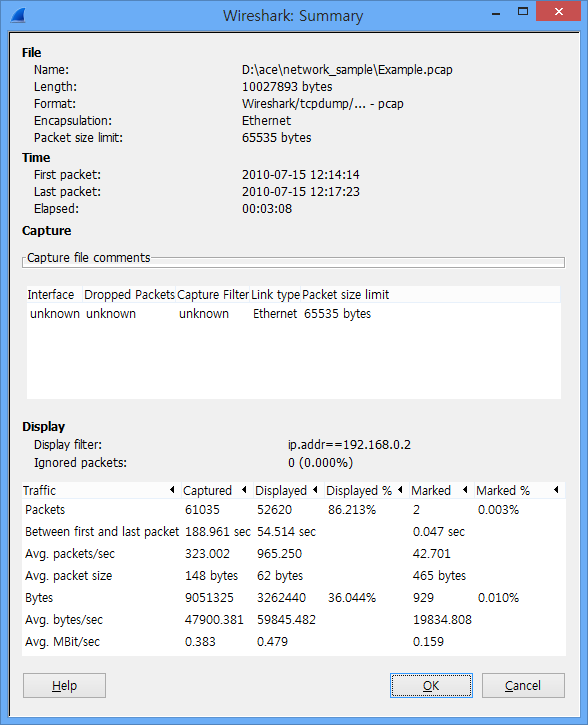

# example.pcap 패킷 분석 보고서

- 분석한 샘플 파일: [Example.pcap](https://github.com/akagaeng/self-study/blob/master/PacketAnalysis/files/Example.pcap)

## 시나리오
트래픽 증가로 인해 네트워크가 느려지고 있어 해당 네트워크에서 패킷을 캡쳐하였다. (TCP Port 80)

1. 이 공격에 대해 설명하고 해결하기 위한 방법으로 어떤 것이 있는지 작성하시오.
2. 패킷내에서 잘못된 파일들을 찾아 암호를 찾고 풀어, 이 공격이 언제 시작해서 언제 끝나는지 추정하시오.

### I. 문제 분석
- victim: 192.168.0.232 (00:1d:7d:a9:20:18)

네이버, 다음, 구글 등의 사이트에서 웹서핑을 하던 도중 악성코드에 감염된 것으로 판단됩니다. 와이어샤크로 패킷을 보던 중 no 7808, 7809의 cmd.htm 파일을 다운받은 이후 다량의 syn packet이 192.168.0.2로 유입되는 것을  발견하였습니다.

**악성코드로 의심되는 cmd.htm, 암호를 찾을 수 있는 logo1.jpg를 발견한 곳**
HxD로 파일을 분석해보니 signature가 zip파일의 것인 **PK**인 것을 발견하였습니다. cmd.htm의 확장자를 zip으로 변경한 후(cmd.htm.zip), 압축을 해제하려 시도하였으나 암호를 요구하였습니다. 따라서 victim이 다운받은 또다른 파일인 logo1.jpg를 분석하였습니다.

logo1.jpg 파일은 파일이 제대로 열리지 않아, HxD로 분석해 본 결과 signature 부분이 jpg파일의 signature가 아닌 다른 hex[09 09]가 들어있어, 이를 jpg 파일의 signature인 [FF D8]로 바꿔주니 이미지 파일을 열어볼 수 있었습니다. 수정된 파일의 출력 결과는 다음과 같습니다.

cmd.htm.zip 파일을 위에 나온 이미지에 적힌 글자인 **Google**을 압축 해제 시의 비밀번호로 입력하니 압축이 풀리고 아래와 같은 파일을 발견할 수 있었습니다. 

- 파일 이름: cmd.php
- 파일 내용: OK,1278946800,1279292400,192.168.0.2,80,0

#### 이 파일 내용에서 알아낸 점
1. **1278946800,1279292400**

epoch time형식인 것으로 판단하였습니다. 따라서 epoch를 human readable time으로 변환해주는 [epochconverter](http://www.epochconverter.com/)라는 사이트에서 위 숫자를 입력한 결과 다음의 사항을 알 수 있었습니다.
   
  + epoch: 1278946800
  + GMT: Mon, 12 Jul 2010 15:00:00 UTC
  + Your time zone: 2010년 7월 13일 화요일 오전 12:00:00 GMT+9:00
   
  
  + epoch: 1279292400
  + GMT: Fri, 16 Jul 2010 15:00:00 UTC
  + Your time zone: 2010년 7월 17일 토요일 오전 12:00:00 GMT+9:00

2. **192.168.0.2,80**
  + ip address와 port number인 것으로 판단됩니다.
  
### II. 파일을 다운받은 이후의 현상.

...

중략

...

- cmd.htm 파일을 다운받은 103.540680초(캡쳐시작한 시간을 0초로 기준으로한 시간. 이하 같음) 이후 30.906368초 후인 134.447048초 부터 다량의 [SYN] 패킷이 192.168.0.2의 80번 포트로 유입되는 것을 확인할 수 있었습니다.

### III. 세부 분석 및 공격 방법 판단
wireshark의 Summary 기능을 활용하여 자세히 분석해보겠습니다.

#### 의심되는 syn packet 분석
- 총 패킷의 수: 52620개
- 전송기간: 54.514초
- 평균 패킷수: 965.250 (패킷/초)
- 평균 패킷의 크기: 62바이트(모두 62바이트로 동일함)
- 총 바이트수: 3262440 바이트
- 평균 전송 크기: 59845.482 (바이트/초)

초당 965개 이상의 패킷이 패킷 수집이 종료될 때 까지인 54초 이상 지속되고 있습니다. 패킷 각각의 크기는 62바이트에 불과하나, 초당 전송된 패킷의 총 크기가 59메가 이상이 되어 충분히 수신자에 부담이 될 수 있으리라 판단됩니다. 이와 같은 상황을 종합해보아 다음과 같은 결론에 이르게 되었습니다.

### 공격 방법
**syn flooding - DDOS( Distribute Denial of service)**

- ip spoofing을 통해 ip를 바꾸어가면서 192.168.0.2에 대하여 계속 syn을 보냄

**공격자    피해자** 
syn-------->syn_recv 
   <--------syn/ack 
(ack ------>) 원래는 ack를 보내야 하는데 이 과정을 생략함 

syn요청에 대해 ack응답이 없으면 ack응답이 있는 동안 일정 시간 대기를 하게 됩니다. 대기시간이 종료하기 전에 다시 syn요청이 있으면 무한대로 응답을 대기하게 되고, 다른 응답에 요청하지 못하는 상태가 됩니다. 
SYN Flooding 공격은 TCP 의 취약점을 이용한 공격의 형태이므로 먼저 TCP 에 대해 알아야 하는데, TCP는 UDP와는 달리 신뢰성 있는 연결을 담당합니다. 따라서 서버와 클라이언트간에 본격적인 통신이 이루어지기 전에는 소위 "3 Way handshaking" 이라는 정해진 규칙이 사전에 선행되어야 합니다. 결과적으로 TCP의 장점인 신뢰성이 TCP의 약점이 되는 것이며 이를 이용하여 DOS공격이 이루어지는 것입니다.

- src MAC: 00:1d:7d:a9:20:18 (동일)
- src IP : 가변

위 공격은 MAC 주소는 동일하나, 출발지 ip를 계속 바꾸어주면서 syn을 보내주는 ipspoofing을 같이 한 것으로 판단됩니다. 클라이언트의 ACK 응답이 없으면 서버에서는 클라이언트의 접속 정보를 잠시 log에 쌓아 두는데, 이러한 요구가 증가했을 경우 시스템은 log 기록 공간을 충분히 확보하지 못하게 되고, 결국 네트워크 중단으로 이어져 서비스 거부가 일어나게 됩니다. 결과적으로 공격자가 80번 포트로 syn만 계속 보내어 다른 사용자의 응답을 받을 수 없는 상태가 되어 인터넷 사용이 불가한 상태에 이르게 됩니다.

### IV. 방어방법

1. **감염 차단**
  - (1) Signature based detection

  협의적인 IPS에 대해 널리 이해되고 있는 기능입니다. 공개된 취약점에 대한 Exploit Code가 존재할 때 이를 signature화 하고 DB 형태로 관리하며 입력된 패킷의 payload를 이 DB에서 검색하여 패킷에 유해 signature가 포함되어 있는지 검사하는 방법으로, 발견된 signature를 통해 공격 종류를 적시할 수 있으며, 공격에 대해서 IP 주소, 프로토콜, 포트 등에 관계없이 명확하게 탐지해 낼 수 있는 반면 Signature가 명확하지 않으면 False Positive가 발생할 확률이 높다는 단점이 있습니다.

  - (2) Anti-Virus

  Payload를 하나의 파일로 형성(Assemble)하여 Virus 검사 엔진에 전송하고 감염여부를 리턴 받아 해당 파일을 원래 세션을 통해 전달(Dissemble)하는 방식으로 Assemble/ Dissemble 과정을 거치므로 속도가 현저히 떨어집니다. 신규 바이러스 패턴의 신속한 업데이트도 필요합니다.

2. **감지 후 차단, 확인 후 통과**

일단 바이러스나 웜에 감염되어 공격 시도 및 2차 감염 시도가 발생하면 전체 세션의 증가, 특정 포트에 대한 트래픽 증가 등 어떤 변화가 발생하게 되고 네트워크 길목에 위치한 IPS에서는 이러한 이상 징후에 기반하여 특이 상황 인지를 할 수 있으며, 차단도 가능하다. 이상 징후들과 그에 대한 대처 방안을 살펴보면, 다음과 같습니다. 

  - (1) 세션 폭주 탐지

  통계 분석 기법에 의해 비정상 트래픽을 차단하는 방식으로 알려지지 않은 유해 트래픽의 피해를 최소화 할 수 있습니다.

  - (2) 세션 제한

  특정 트래픽에 대해 전체 세션 제한을 설정하는 방법으로 네트워크 장비들을 보호할 수 있으나, 정상적인 세션까지 영향을 받을 수 있는 단점이 있습니다.

  - (3) 한계 값 초과 탐지

  특정 목적지로의 SYN 요청이 단위 시간당 한계 값을 초과하는 경우 해당 목적지 IP 주소로 향하는 모든 패킷을 차단하는 방식으로 유해 트래픽 차단은 이루어지나, 해당 목적지 서버가 수행하는 서비스가 전면적으로 불통될 수 있다는 것이 단점입니다.

  - (4) 발신지 IP 주소에 대한 확인

  실제 존재하는 발신지 주소인지 혹은 유효한 주소인지 검증 후 패킷의 통과 여부를 결정하는 방식으로 다음과 같은 차단 방법들이 있습니다.
    + RFC1912에서 정의한 비공인 IP 주소는 차단합니다.
    + 255.255.255.255 등과 같은 도저히 발신지 IP 주소로 사용할 수 없는 주소는 차단합니다.
    + IANA가 할당하지 않은 IP 주소이면 차단합니다.
    + IP Header를 이용하여 TTL 값이 일정하면서 발신지 IP 주소가 변하는 SYN Packet들을 차단합니다.
    + 모든 SYN 패킷에 대해서 발신지 확인 패킷을 보내고 해당 응답에 따라서 통과 및 차단을 결정합니다.

  - (5) White List기법

  SYN Flooding에 의해 발생하는 IP 주소들은 대부분 실제로 존재하지 않는 경우가 대부분이라는 점을 이용한 기법이다. 이때, IPS는 실제로 존재하는 IP 주소 List를 가지고 있다면, 이 List에 존재하지 않는 IP 주소를 목적지로 하거나 발신지로 하는 Packet들을 모두 차단하는 기능입니다.

3. **발생 차단**

이 방법은 유해 트래픽을 발생시키는 클라이언트를 찾아내어 발생 자체를 차단하는 방법으로 발생의 근원을 네트워크에서 완전히 격리시키게 됩니다. 
내부의 모든 Client들에 Agent를 설치하여, 이들 Agent와 IPS가 통신을 하며, 이상 트래픽 검출 시 해당 트래픽을 유출하는 컴퓨터에 강제 차단 명령을 보내어 네트워크로부터 격리시킵니다. 다양한 경로를 통하여 침투된 Worm 및 Virus를 신속히 격리하는 가장 효과적인 방법입니다. 이를 위해 Agent의 설치, 탐지 및 격리 3단계의 작업이 수행됩니다.

4. **최선의 방법 선택**

SYN Flooding이라는 단 하나의 구체적 위협에 대한 방어가 다양한 측면의 다양한 기능이 어떤 구체적인 방법으로 이루어지는지를 살펴보았습니다. 위에서 설명한 방법들은 제 각각 단점은 있지만 독립된 기능으로써도 충분한 가치는 있습니다. 어느 한가지 가장 최선의 단 한가지 방법을 선택할 수는 없습니다.
왜냐하면 각각의 기능들이 제 각각의 단점과 장점을 가지고, 각 사이트 상황에 따라 적용의 효과가 다르게 나타나기 때문입니다. 따라서, 최선은 각각의 단점들을 상호 보완할 수 있는 즉, 위 3가지 방법들의 기능을 하나의 통합된 IPS로 구현하여, 3중의 방어체계를 갖추도록 하는 것입니다. IPS는 앞에서 기술되었듯이 인터넷의 위협들에 대해 다측면 방어를 수행하는 통합 보안 장비여야 합니다.

참조: [IPS 해부, SYN Flooding 공격 방어 기능](https://blog.naver.com/PostView.nhn?blogId=shm0103&logNo=60032984237&proxyReferer=https%3A%2F%2Fwww.google.co.kr%2F)

### V. 결론

위 상황을 종합하여 볼 때, 한국시간으로 2010년 7월13일 화요일 오전 12시에 공격 명령을 시작 2010년 7월17일 토요일 오전 12시에 공격 명령을 종료하는 명령에 따라 처음 패킷이 수집된 2010년07월15일 12:14:14분부터 103.540680초 지난 시기에 악성코드를 다운받아 그로부터 30.906368초 후인 134.447048부터 ip spoofing을 통한 DDOS(SYN FLOODING) 공격에 노출되었습니다. 이에 공격 종료 예상시기인  2010년 7월17일 토요일 오전 12시까지 별다른 조치가 없는 경우 인터넷 사용이 불가할 것으로 판단됩니다. 위의 방법 중 한개 이상의 조치를 취하여 DDOS공격에 대비해야 할 것입니다.
