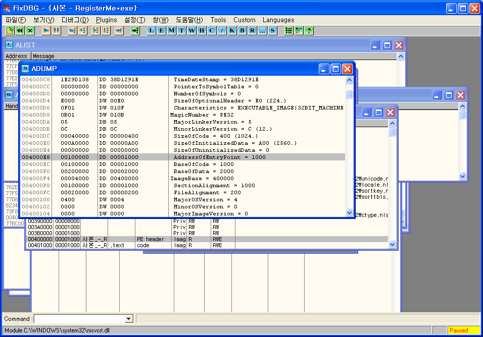
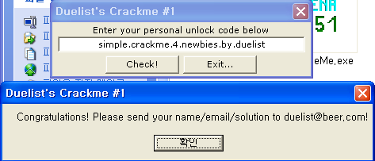

# Password crack practice (Windows system hacking)

### 들어가며
인터넷에서 패스워드 크랙 연습을 위해 공개되어 있는 [패스워드 크랙 연습용 파일](https://github.com/akagaeng/self-study/raw/master/Password-Crack/files/windows_system_sample.zip)들을 이용하여 비밀번호를 풀어보았습니다. 바이너리 파일 분석을 위해 OLLYDBG(올리디버거)를 사용하였습니다. 올리디버거 사용시 기본적으로 필요한 단축키는 다음과 같습니다.
- continue: F9
- ni: f8
- si: f7 (함수 내부까지 들어감)
- 소프트웨어 브레이크포인트: F2

### 문제 해결
1. reverseMe.exe

#### 코드 패칭으로 해결
- jnz short 004010D0 을 congratulations가 나오는 곳 위치로 변경(jnz 00401205)
- jnz --> jmp로 변경
  + short jmp를 long jmp로 바꾸는 등 여러가지 방법 사용 가능하다.
- 마우스 오른쪽 클릭-> copy to excutable -> 마우스 오른쪽 클릭 -> save file
- readfile(hfile, buffer, bytestoread, pbytesread, poverlapped);

#### 조건을 만족시킴으로써 크랙
- hFile : 읽고자 하는 파일의 핸들. 이 파일은 GENERIC_READ 액세스 권한으로 열어야 함
- lpBuffer : 읽는 데이터를 저장할 버퍼의 포인터, 충분한 길이를 가지고 있어야 함
- nNumberOfBytesToRead : 읽고자 하는 바이트 수
- lpNumberOfBytesRead : 실제로 읽은 바이트 수를 리턴받기 위한 출력용 인수. ReadFile은 호출 즉시 이 값을 0으로 만든다. 비동기 입출력을 하지 않을 경우 이 인수는 NULL로 줄 수 없으며 반드시 DWORD형 변수에 대한 포인터를 제공해야 한다.
- lpOverlapped : 비동기 입출력을 위한 OVERLAPPED 구조체의 포인터. 파일을 FILE_FLAG_OVERLAPPED 플래그로 열었으면 이 구조체를 반드시 제공해야 한다. 비동기 입출력을 사용하지 않을 경우 NULL을 주면 된다.

성공하면 0이 아닌 값을 리턴한다. 만약 리턴값이 0이 아닌데 실제 읽은 바이트가 0이라면 파일 포인터가 끝부분(EOF)인 것이다. 실패하면 0을 리턴한다.

```text    
문제에서
- hfile: eax
- buffer: reverseM.0040211A
- BytestoRead(70bytes)
- pBytesRead: reverseM.00402173
- pOverlapped: NULL

*00402173에 파일의 바이트수가 입력됨
cmp al,47 ==> 47=>'G' 
글자가 하나 있을때마다 EBX 증가시키며
G가 있을때마다 esi를 증가시키며, esi와 8을 비교함
G의 갯수가 8개이면 조건 만족시켜 루프를 벗어나게 된다.

createfile // readfile
```
2. register me
- 처음 실행시 다음과 같이 세개의 오류메시지가 나온다.


- nag창 없애기(nag: 귀찮게하다)
- M아이콘 눌러보면 00400000 등 주소 보인다. 00400000눌러본 후 004000E8에서 보면 다음과 같다.



- Address of entry point를 1000--> 1024로 변경(시작위치를 처음 메시지창 다음으로 옮김)
- ctrl+G로 주소 이동
- 두번째 메시지창 없애기 위해서 NOP으로 채움

#### c.f. registerME. WOOPS
- register me 파일에 안티디버깅 기법이 적용된 파일로써 실행은 되나, 디버거에서 열면 아래와 같은 메시지 뜬다.


- 디버그 하지 못하도록 안티디버깅 기법이 적용되어 있다. 따라서 올리디버거에서는 수정후 저장이 안되므로 HxD에서 registerME 파일과 비교해가면서 파일 수정하기.
(수정이 성공하면 올리디버거에서 오류없이 로드 가능)

3. test.exe

- 올리디버거로 열어보니 수상한 부분 발견


- %c있는 곳에 눌러보니 아스키 코드가 하나씩 있음
역순으로 넣어보면 `<< Asm07REC >>`


성공 (대소문자 상관은없는듯)

- 리눅스
  + _startup함수-> main함수-> sub function ... (코드를 다 보고 찾아내는 게 좋음)
- 윈도우즈
  + startup code--> main함수 (필요한 부분만 보고 찾아도 됨)

4. abexcm3.exe
- keyfile이름이 abex.l2c 이고 크기가 18바이트이면 됨
- keyfile에 "A" x 18 채우면 끝

5. Crackme_05.exe
- 오류메시지 앞에 브레이크 걸어두고 실행하면 string1에 시리얼넘버 보인다.
- `L2C-57816784-ABEX`


6. due-cm1.exe


- xor연산을 3번 한 값과 아래의 값과 비교하는 과정을 거침

```
004020D3  7B 61 65 78 64 6D 26 6B 7A 69 6B 63 65 6D 26 3C  {aexdm&kzikcem&<
004020E3  26 66 6D 7F 6A 61 6D 7B 26 6A 71 26 6C 7D 6D 64  &fmjam{&jq&l}md
004020F3  61 7B 7C 00                                                          a{|.
```

- 3번 xor연산 후에 `{aexdm&kzikcem&<&fmjam{&jq&l}mda{|.`와 같은 아스키 문자가 나오도록 해야하므로 프로그래밍을 통해 그 값을 구해보도록 하였다.

* 시행착오
`char ch[]="{aexdm&kzikcem&<&fmjam{&jq&l}mda{|."`
와 같이 문자를 통해 xor연산을 거쳤더니 `simple.crackme.4.nbies.by.duelist`와 같이 나오고 
ew가 누락되었다
- 알아보니 0x7F가 아스키 코드로 DEL이므로 문자로 표현이 불가하였다.
- 어쩔수없이 아스키코드를 각각 배열에 집어넣어 준 후 연산을 하도록 하였음

c언어 코드
```c
#include <stdio.h>
#include <string.h>
int main(){
  int i,i_1,i_2,i_3,j,leng;
  char ch[]={ 0x7B,0x61,0x65,0x78,0x64,0x6D,0x26,0x6B,0x7A,0x69,
              0x6B,0x63,0x65,0x6D,0x26,0x3C,0x26,0x66,0x6D,0x7F,
              0x6A,0x61,0x6D,0x7B,0x26,0x6A,0x71,0x26,0x6C,0x7D,
              0x6D,0x64,0x61,0x7B,0x7C,0x00};
  
  leng=strlen(ch);
  
  printf("=============crack tool============\n");
  printf("length: %d\n",leng);
  for(j=0;j<leng;j++){
    for(i=0x00;i<0xff;i++) {
      i_1=i^0x43;
      i_2=i_1^0x1E;
      i_3=i_2^0x55;
      if(i_3==ch[j]){
        printf("%c",i);
        break;
      }
    }
  }
  printf("\n");
  printf("===================================\n");
  printf("                            -HACKED\n");
  return 0;
}
```

(참고) `a xor 43 = 7B` 인 경우 `a= 43 xor 7B` 이렇게 해도 됨 (교환법칙 성립)

(결과)




성공!

7. k4n.exe
- name 4~50글자
- 중간에 브레이크포인트 잡아두고 name을 임의로 abcd라고 입력해줌
- string2에 C240이 뜨고 비교하는 루틴 있음
- serial에 C240써 줌

완료!
- 난이도에 비해 방향을 잡지 못해서 꽤 시간이 많이 걸렸다.


8. due-cm2.exe

#### 디버거로 코드 분석 결과
1. due-cm2.dat 생성
2. 파일사이즈 0x12(18)바이트 이상
3. due-cm2.dat 파일 체크

- 0x00인 경우 esi 2인지 체크(작은 경우 종료, 큰 경우 continue)
- 0x00아닌 경우: 0x01인지 체크 (0x01이면 esi, ebx증가 / 아니면 ebx증가) --> 0x01이 2개 이상 있어야 함

#### esi 2이상 통과
- esi, ebx 초기화

#### 파일내의 hex판단
- 0인경우: esi가 0x1D5(469)인지 판단(469=7x67(0x43))
- 1인 경우: 상동
- 나머지: 다 더한 값이 0x1D5인지 판단
(0이나 1인 경우는 esi가 0x1D5가 안나오므로 "나머지" 케이스로 가야함)

#### esi: 1D5조건 통과
- 0x01인지 판단 후, esi가 0x1B2(434)인지 판단
- 2로 나누면 217(0xD9, 2개면 됨)


성공! 시간이 꽤 오래 걸렸음...

9. due-cm3.exe
소스를 보다보니 각 칸이 가리키는 숫자가 뒤죽박죽이다.
힌트에서 나온 것처럼 리소스 에디터(XN 리소스 에디터라는 프로그램 사용)로 열어보니...


004020FE
```
ESI	1	2	3	4	5	6	7	8	9	10	11	12	13	14	15	16	17	18	(19)
HEX	16	49	5E	15	27	26	21	25	1D	59	53	37	31	48	5D	0C	61	52	4D
```

체크박스
```
체크박스 순서	1-1	1-2	1-3	1-4	1-5	1-6	1-7	1-8	1-9	2-1	2-2	2-3	2-4	2-5	2-6	2-7	2-8	2-9
해당 ESI	17	2	3	1	8	6	7	10	11	4	12	13	14	15	16	18	5	9
HEX	61	49	5E	16	25	26	21	59	53	15	37	31	48	5D	0C	52	27	1D
```

#### 공식
`[체크박스에 체크한 것의 해당 ESI] * [ESI에 해당하는 HEX] * [ESI+1에 해당하는 HEX]`
- EAX x ECX x ESI 한 후 지금까지값과 더함
- 여기다가 4D곱한 값이 0F35466이 되어야 하므로 `0F35466 / 4D = 328FE` 이므로 합은 `328FE`가 되어야 한다.

- 18 C n의 조합이 나오므로 가짓수가 매우 많다. 프로그래밍으로 해결해보자!

#### 아이디어
1. 18개의 선택지 중에서 1개, 2개, 3개 .. 18개를 고른 후 고른 수를 더하기
2. arr[18]을 만들어서 0, 1을 순차적으로 반복하여 올라가도록 한 후 행렬곱 이용
  - 2진수 111111111111111111~000000000000000000 에 해당하는 16진수(10진수)값인 262143(0x3FFFF) ~ 0까지 감소시키면서 arr[18]의 arr[0]~arr[17]에 자릿수별로 0 또는 1이 저장되도록 한 다음에 행렬 곱을 이용. 행렬값이 1인 경우 체크표시 한 경우에 대응되며, 행렬값이 0인 경우 체크표시 하지 않은 경우에 대응되어 위 프로그램의 체크루틴과 동일한 기능을 할 수 있음.

### 문제 해결
```c
#include <stdio.h>
#include <math.h>
int main()
{
  int i, j = 0, pow_calc, temp, a, sum;
  int answer = 0x328FE;
  int arr_bin[18];

  //0x004020FE
  int arr1[] = {
      0x16, 0x49, 0x5E,
      0x15, 0x27, 0x26,
      0x21, 0x25, 0x1D,
      0x59, 0x53, 0x37,
      0x31, 0x48, 0x5D,
      0x0C, 0x61, 0x52, 0x4D};

  //CHECK BOX -이 배열은 계산시에는 필요없음
  /*
      int arr2[]={
      0x61,0x49,0x5E,
      0x16,0x25,0x26,
      0x21,0x59,0x53,
      0x15,0x37,0x31,
      0x48,0x5D,0x0C,
      0x52,0x27,0x1D };
    */

  int ecx[] = {17, 2, 3, 1, 8, 6, 7, 10, 11, 4, 12, 13, 14, 15, 16, 18, 5, 9};
  int arr_result[18] = {0,};

  printf("\n");

  for (i = 0; i < 18; i++){
    arr_result[i] = ecx[i] * arr1[ecx[i] - 1] * arr1[ecx[i] - 1 + 1];
    printf("ECX:%d\t", ecx[i]);
    printf("arr[%2d]:%x\t", i, arr1[i]);
    printf("arr+1[%2d]:%x\t", i, arr1[i + 1]);
    printf("arr_result[%2d]:%x\n", ecx[i] - 1, arr_result[i]);
  }
  printf("=============================================================\n\n");

  //BINARY CASE
  printf("WAIT LOADING...\n");
  //0x111111111111111111 = 0x3FFFF = 262143
  for (i = 0, j = 0; i <= 262143; i++) { //왼쪽은 작->큰 ,우측은 큰->작
    for (i = 262143, j = 0; i >= 0; i--) {
      arr_bin[0] = i;
      //printf("arr_bin[17-j]: %d, i: %d ",arr_bin[17-j],i);
      for (j = 17; j > 0; j--) {
        temp = arr_bin[17 - j];
        pow_calc = pow(2, j);
        //printf("j: %d 17-j: %d temp: %d ",j,17-j,temp);
        arr_bin[17 - j] = temp / pow_calc;
        arr_bin[17 - j + 1] = temp % pow_calc;
        //printf("arr_bin[%d]=%d (%x)\n",17-j,arr_bin[17-j],arr_bin[17-j]);
        if (17 - j + 1 == 17) { 
          //printf("arr_bin[%d]=%d (%x)\n",17-j+1,arr_bin[17-j+1],arr_bin[17-j+1]);
        }
      }
      //printf("\n");
      for (j = 0, a = 0, sum = 0; j < 18; j++) {
        a = arr_bin[j] * arr_result[j];
        sum = sum + a;
        //printf("a: %x\n",a);
        //printf("sum: %x\n",sum);
      }
      if (sum == answer) {
        printf("\n************ANSWER************\n\n");
        printf("DEC: %d\n", i);
        printf("HEX: %x\n", i);
        printf("BIN: ", i);
        for (j = 0; j < 18; j++) {
          printf("%d", arr_bin[j]);
        }
        printf("\n\n          CHKBOX\n", i);
        for (j = 0; j < 18; j++) {
          if (arr_bin[j] == 0) {
            printf("[ ]");
          } else {
            printf("[v]");
          }

          if (j == 8) {
            printf("\n");
          }
        }
        printf("\n\n******************************\n\n");
        break;
      }
    }
    return 0;
  }
```


보기 쉽도록 체크박스 그림까지 넣어보았다. 행렬arr[j]을 나눗셈시 직접 이용하면 0으로 인식하는 버그?를 발견한 바 temp=arr[j] 로 넣어준 후 계산 후 돌려주는 방법으로 우회하였다. 2^n을 계산하기 위한 라이브러리함수로 pow(x,n)를 사용하여고 math.h를 include했고, 리눅스에서 math.h를 include한 경우 아래와 같이 -lm 옵션을 추가하여아 한다.

`#> gcc -lm -o due3_findhex due3_findhex.c`

중간에 생각대로 출력이 되지 않아 버그를 발견하는 데 꽤 많은 시간을 할애하였다. 프로그래밍 작성 후 정답이 나왔으나, 실제로 크랙이 되지 않아 확인해보니
- i)처음 사용하였던 리소스해커라는 프로그램이 id값을 잘못 알려주었으며
- ii) 바이너리 분석이 조금 잘못되었음을 인지하여 다시 분석하였다. 

많은 고생끝에 성공!


### 문제 해결

이미 문제를 해결하였으나, 좀 더 쉬운 방법을 생각하다가 랜덤함수를 이용하여 푸는 방식을 생각해보았다.

```c
#include <stdio.h>
#include <stdlib.h>
int main()
{
  int arr[] = {
    0x21032, 0x359c, 0x1722, 0x646, 0x2188, 0x1d64,
    0x2163, 0x1208e, 0xc427, 0xccc, 0x7e54, 0xb328,
    0x16e30, 0x4164, 0x48c0, 0x1bbf4, 0x1cf2, 0x5abd };
  int ran[18] = {0,};
  int i, sum;
  int answer = 0x328FE;
  srand(time(NULL));

  while (1) {
    for (i = 0, sum = 0; i < 18; i++) {
      ran[i] = rand() % 2;
      sum = sum + arr[i] * ran[i];
    }
    
    if (sum == answer) {
      printf("\nBINARY\n");
      for (i = 0; i < 18; i++) {
        printf("%d", ran[i]);
      }
      break;
    } else {
      sum = 0;
    }
  }
  printf("\n\nCHKBOX\n", i);
  for (i = 0; i < 18; i++) {
    if (ran[i] == 0) { 
      printf("[ ]"); 
    } else { 
      printf("[v]"); 
    }
    
    if (i == 8 || i == 17) { 
      printf("\n");
    }
  }
  return 0;
}
```

- 코드짜기 훨씬 간단하고, 라인수도 짧아졌다.
- 문제를 해결하기만 하면 되는 이 문제의 특성상 훨씬 좋은 프로그램이라고 판단된다.